# 垃圾回收

## 1 垃圾回收概述

### 1.1 什么是垃圾？

垃圾是指在**运行程序中没有任何指针指向的对象**，这个对象就是需要被回收的垃圾。

- 内存溢出
- 内存泄漏：对象不用了，但是对象有被引用，无法进行回收

### 1.2 为什么需要 GC？

- 不进行垃圾回收，内存迟早会被消耗完
- 对碎片进行整理，以便 JVM 整理出的内存能够分配给新的大对象
- 随着应用程序所应对的业务越来越大，越来越复杂，没有 GC 就不能保证应用程序的正常进行

### 1.3 早期垃圾回收

在早期的 C/C++ 时代，垃圾回收基本上是手工进行的。这种方式可以灵活控制内存释放的时间，但是会给开发人员带来**频繁申请和释放内存的管理负担**。倘若一处内存区间由于程序员编码的问题忘记被回收，那么就会产生**内存泄漏**，垃圾对象永远无法被清除，随着系统运行时间的不断增长，垃圾对象可能持续上升，直到出现**内存溢出**并造成应用程序崩溃。

### 1.4 Java垃圾回收机制

Java 垃圾回收可以对年轻代回收，也可以对老年代回收，甚至是对全堆和方法区的回收

其中，Java 堆是垃圾收集器的工作重点

从次数上讲：频繁收集 Young 区，较少收集 Old 区，基本不动 Perm 区（或元空间）

## 2 垃圾回收的相关算法

在堆里存放着几乎所有 Java 对象实例，在 GC 执行垃圾回收之前，首先**需要区分出内存中哪些是存活对象，哪些是已经死亡的对象**。只有被别标记为已经死亡的对象，GC才会在执行垃圾回收时，释放掉其所占用的内存空间，因此这个过程我们可以称为**垃圾标记阶段**。

当一个对象已经不再被任何的存活对象继续引用时，就可以宣判该**对象死亡**。

判断对象存活一般有两种方式：**引用计数算法**和**可达性分析算法**。

### 2.1 垃圾标记阶段

**引用计数算法**

引用计数算法（Reference Counting）比较简单，对每个对象保存一个整数的引用计数器属性，**用于记录对象被引用的情况**。

对于一个对象A，只要有任何一个对象引用了A，则A的引用计数器就加1；当引用失败时，引用计数器就减1。只要对象A的引用计数器的值为0，即表示对象A不可能再被使用，可进行回收。

优点：

- 实现简单，垃圾对象便于辨识
- 判定效率高，回收没有延迟性

缺点：

- 需要单独的字段存储计数器，这样的做法**增加了存储空间的开销**
- 每次赋值都需要更新计数器，伴随着加法和减法操作，这**增加了时间开销**
- 引用计数器有一个严重的问题，即**无法处理循环引用**的情况。这是一条致命缺陷，导致在 Java 的垃圾回收器中**没有使用这类算法**。

引用计数算法因为无法处理循环引用而导致的内存泄漏

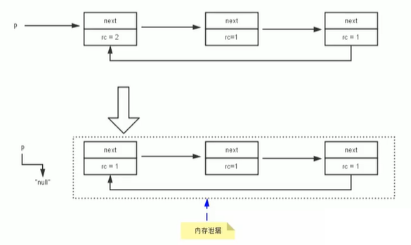

**可达性分析算法（根搜索算法，追踪性垃圾收集）**

相对于引用计数算法而言，可达性分析算法不仅同样具备实现简单和执行高效等特点，更重要的是该算法可以有效地**解决在引用计数算法中循环引用的问题**，防止内存泄漏的发生。

所谓 GC Roots 根集合就是一组必须活跃的引用（一般是指不存在于堆中，但是指向堆中对象的引用），包括：

- 虚拟机栈中引用的对象
    - 比如：各个线程被调用的方法中使用到的参数、局部变量等
- 本地方法栈内 JNI（通常说的本地方法）引用的对象
- 方法区中类静态属性引用的对象
    - 比如：Java 类的引用类型静态变量
- 方法区中常量引用的对象
    - 比如：字符串常量池（String Table）里的引用
- 所有被同步锁 synchronized 持有的对象
- Java 虚拟机内部的引用
    - 基本数据类型对应的 Class 对象，一些常驻的异常对象（如：NullPointerException、OutOfMemoryError），系统类加载器
- 反映 Java 虚拟机内部情况的 JMXBean、JVMTI 中注册的回调、本地代码缓存等

基本思路：

- 可达性分析算法是以跟对象集合（GC Roots）为起始点，按照从上至下的方式**搜索被根对象集合所连接的目标对象是否可达**。
- 使用可达性分析算法后，内存中的存活对象都会被根对象集合直接或间接连接着，搜索所走过的路径称为**引用链（Reference Chain）**
- 如果目标对象**没有任何引用链相连**，则是**不可达的**，就意味着该对象已经死亡，可以标记为垃圾对象。
- 在可达性分析算法中，只有能够**被根对象集合直接或者间接连接的对象才是存活对象**。

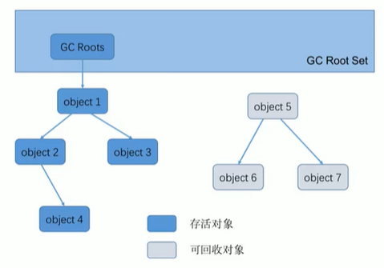

注意：

如果要使用可达性分析算法来判断内存是否可以被回收，那么分析工作必须在一个能保障一致性的快照中进行。这点不满足的话结果的准确性就无法保证。

这点也是导致GC进行时必须 Stop The World 的一个重要原因

**对象的 finalization 机制**

Java 语言提供了对象终止（finaliztion）机制来允许开发人员提供**对象被销毁之前的自定义处理逻辑**

当垃圾回收器发现没有引用指向一个对象，即：垃圾回收此对象之前，总会先调用这个对象的 `finalize()` 方法。

finalize() 方法允许在子类中被重写，**用于在对象被回收时进行资源释放**。通常在这个方法中进行一些资源释放和清理的工作，比如关闭文件、套接字和数据库连接等。

不要主动调用 finalize() 方法，应该交给垃圾回收机制调用。

虚拟机中对象的三种状态（这三种状态是由于 `finalize()` 方法的存在进行区分的）：

- 可触及：从根节点开始，可以到达这个对象
- 可复活的：对象的所有引用都被释放，但是对象有可能在 finalize() 中复活
- 不可触及的：对象的 finalize() 被调用，并且没有复活，那么就会进入不可触及状态。不可触及的对象不可能被复活，因为 finalize() 只会被调用一次


判定一个对象 objA 是否可回收，至多要经历两次标记过程：

1. 如果对象 objA 到 GC Root。没有引用链，则进行第一次标记。
2. 进行筛选，判断此对象是否有必要执行 finalize() 方法 
    1. 如果对象 objA 没有里写 finalize() 方法，或者finalize(）方法己经被虚拟机调用过，则虚拟机视为“没有必要执行”,objA 被判定为不可触及的。
    2. 如果对象 objA 重写了 finalize() 方法，且还未执行过，那么 objA 会被插入到 F-Queue 队列中，由一个虚拟机自动创建的、低优先级的 Finalizer 线程触发其finalize() 方执行。
    3. finalize() 方法是对象逃脱死亡的最后机会，稍后 GC 会对 F-Queue 队列中的对象进行第二次标记。**如果 objA 在finalize() 方法中与引用链上的任何一个对象建立了联系**，那么在第二次标记时，objA 会被移出“即将回收”集合。之后，对象会再次出现没有引用存在的情况。在这个情况下，finalize方法不会被再次调用，对象会直接变成不可触及的状态，也就是说，一个对象的finalize方法只会被调用一次。 

### 2.2 垃圾清除阶段

当成功区分出内存中存活的对象和死亡对象后，GC接下来的任务就是执行垃圾回收，释放掉无用对象所占用的内存空间，以便有足够的可用内存空间为新对象分配内存。

目前在 JVM 中比较常见的三种垃圾收集算法是**标记-清除算法（Mark-Sweep）**、**复制算法（Copying）**、**标记-压缩算法（Mark-Compact）**。

#### **标记-清除算法（Mark-Sweep）**

执行过程：

当堆中的有效内存空问(available memory）被耗尽的时候，就会停止整个程序（也被称为stop the world)，然后进行两项工作，第一项则是标记，第二项则是清除。

- 标记：Collector 从引用根节点开始遍历，标记所有被引用的对象。一般是在对象的 Header 中记录为可达对象。
- 清除：Collector 对堆内存从头到尾进行线性的遍历，如果发现某个对象在其 Header 没有标记为可达对象，则将其回收。

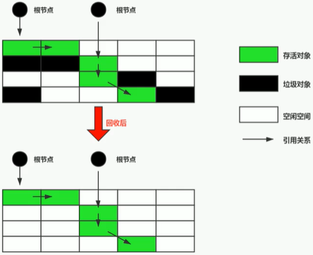

优点：

基础，常见，易于理解

缺点：

- 效率不算高
- 在进行GC的时候需要停止整个应用程序，导致用户体验差
- 这种方式清理出来的空闲内存不是连续的，产生内存碎片。需要维护一个空闲列表。

注意：何为清除？

这里所谓的清除并不是真的置空，而是把需要清除的对象地址保存在空闲的地址列表里。下次有新的对象需要加载时，判断垃圾的位置空间是否足够，如果够，就存放。

#### **复制算法（Copying）**

核心思想：

将活着的内存空间分为两块，每次只使用其中一块，在垃圾回收时将正在使用的内存中存活对象复制到未被使用的内存块中，之后清除正在使用的内存块中的所有对象，交换两个内存中的角色，最后完成垃圾回收。

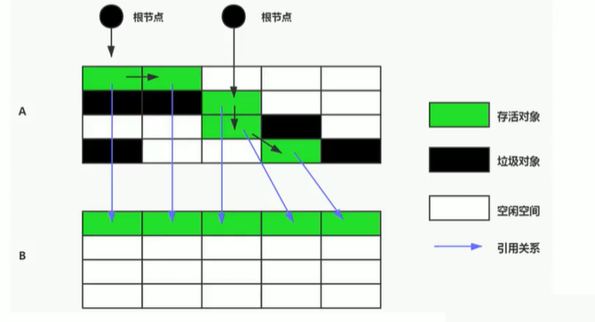

优点：

- 没有标记和清除过程，实现简单，运行高效
- 复制过去以后保证空间的连续性，不会出现“碎片”问题

缺点：

- 需要两倍的内存空间
- 对于G1这种分拆成为大量region的GC，复制而不是移动，意味着GC需要维护regin之间对象引用关系，不管是内存占用或者时间开销也不小

特别的：

如果系统中的存活对象很多，复制算法不会很理想，因为这不但会产生复制的开销，还会存在对象引用关系处理的开销。

新生代中的绝大部分对象都是朝生夕死的，所以Survivor区比较适合用复制算法。

#### **标记-压缩算法（Mark-Compact）**

执行过程：

第一阶段和标记-清除算法一样，从根节点开始标记所有被引用对象

第二阶段将所有存活对象压缩到内存的一端，按顺序排放。

之后，清理边界外所有的空间。

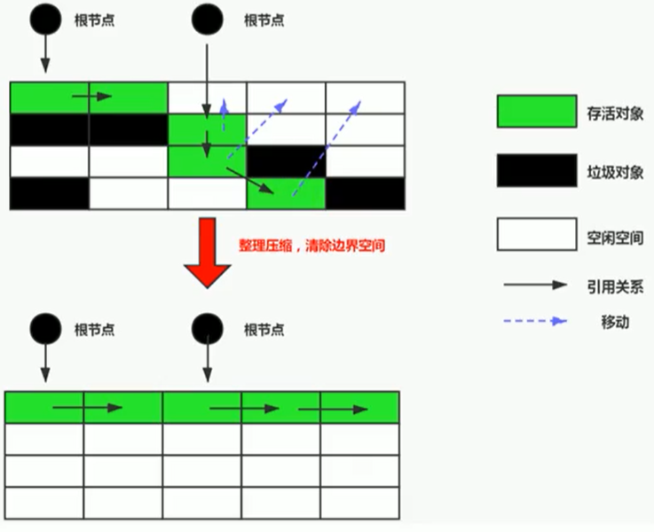

标记一压缩算法的最终效果等同于标记-清除算法执行完成后，再进行一次内存碎片整理，因此，也可以把它称为**标记-清除-压缩(Mark-Sweep-Compact）算法**。 

二者的本质差异在于标记-清除算法是一种**非移动式的回收算法**，标记-压缩是**移动式的**。是否移动回收后的存活对象是一项优缺点并存的风险决策。 

可以看到，标记的存活对象将会被整理，按照内存地址依次排列，而未被标记的内存会被清理掉。如此一来，当我们而要给新对象分配内存时，JVM只需要持有一个内存的起始地址即可，这比维护一个空闲列表显然少了许多开销。 

优点：

- 消除了标记-清除算法当中内存区域分散的缺点，我们需要给新对象分配内存时，JVM 只需要持有一个内存的起始地址即可。
- 消除了复制算法当中，内存减半的高额代价

缺点：

- 从效率来说，标记-整理算法要低于复制算法
- 移动对象的同时，如果对象被其他对象引用，还需要调整引用的地址
- 移动过程中，需要全程暂停用户应用程序。即，STW

#### **小结**
|   |Mark-Sweep|Mark-Compact|Copying|
|---|----------|------------|-------|
|速度|中等|最慢|最快|
|空间开销|少（但会堆积碎片）|少（不堆积碎片）|通常需要活对象的２倍大小（不堆积碎片）|
|移动对象|否|是|是|

### 2.3 垃圾回收算法

#### **分代收集算法**

前面所有这些算法中，并没有一种算法可以完全替代其他算法，它们都具有自己独特的优势和特点。分代收集算法应运而生。

分代收集算法，是基于这样一个事实：不同的对象的生命周期是不一样的。因此，**不同生命周期的对象可以采取不同的收集方式，以便捉高回收效率**。一般是把 Java 堆分为新生代和老年代，这样就可以根据各个年代的特点使用不同的回收算法，以提高垃圾回收的效率。 

在 Java 程序运行的过程中，会产生大量的对象，其中有些对象是与业务信息相关，比如 **HTTP请求中的 Session对象、线程、Socket连接**，这类对象跟业务直接挂钩，因此生命周期比较长。但是还有一些对象，主要是程序运行过程中生成的临时变量，这些对象生命周期会比较短，比如：**String对象**，由于其不变类的特性，系统会产生大量的这些对象，有些对象甚至只用一次即可回收。 

目前几乎所有的GC都是采用分代收集（Generational Collectiong）算法执行垃圾回收的。

在HotSpot中，基于分代的概念，GC所使用的内存回收算法必须结合年轻代和老年代各自的特点。

**1 年轻代（Young Gen）**

年轻代的特点：区域相对老年代较小，对象生命周期短、存活率低，回收频繁。

这种情况复制算法的回收整理，速度是最快的。复制算法的效率只和当前存活对象大小有关，因此很适用于年轻代的回收。而复制算法内存利用率不高的问题，通过HotSpot中的两个survivor的设计得到缓解。

**2 老年代（Tenured Gen）**

老年代特点：区域较大，对象生命周期长、存活率高，回收不及年轻代频繁。

这种情况存在大量存活率高的对象，复制算法明显变得不合适。一般是由**标记-清除**或者**标记-清除与标记-压缩的混合**实现。

- Mark 阶段的开销与存活对象的数量成正比
- Sweep 阶段的开销与所管理区域的大小成正比
- Compact 阶段的开销与存活对象的数据成正比

以 HotSpot 中的 CMS 回收器为例，CMS 是基于 Mark-Sweep 实现的，对于对象的回收效率很高。而对于碎片问题，CMS 采用基于 Mark-Compact 算法的 Serial Old 回收器作为补偿措施：当内存回收不佳（碎片导致的 Concurrent Mode Failure 时)，将采用 Serial Old 执行 Full GC 以达到对老年代内存的整理。 

分代的思想被现有的虚拟机广泛使用。几乎所有的垃圾回收器都区分新生代和老年代。 

#### **增量收集算法**（并发式垃圾回收）

基本思想

如果一次性将所有的垃圾进行处理，需要造成系统长时间的停顿，那么就可以让垃圾收集线程和应用程序线程交替执行。每次，**垃圾收集线程只收集一小片区域的内存空间，接着切换到应用程序线程。依次反复，直到垃圾收集完成。**

总的来说，增量收集算法的基础仍是传统的标记-清除和复制算法。增量收集算法通过**对线程间冲突的妥善处理，允许垃圾收集线程以分阶段的方式完成标记、清理或复制工作。**


缺点

使用这种方式，由于在垃圾回收过程中，间断性地还执行了应用程序代码， 所以能减少系统的停顿时问。但是，因为线程切换和上下文转换的消耗，会使得垃圾回收的总体成本上升，造成系统吞吐量的下降。

#### **分区算法**（代表：G1）

一般来说．在相同条件下．堆空间越大，一次GC所要的时间就越长，有关GC产生的停顿也越长。为了更好地控制GC产生的停顿时间，将一块大的内存区域分割成多个小块，根据目标的停顿时间，每次合理地回收若干个小区间，而不是整个堆空间，从而减少一次GC所产生的停顿。

分代算法将按照对象的生命周期长短划分成两个部分，分区算法将整个堆空间划分成连续的不同小区间。每一个小区间独立使用，独立回收。这种算法的好处是可以控制一次回收多少个小区间。

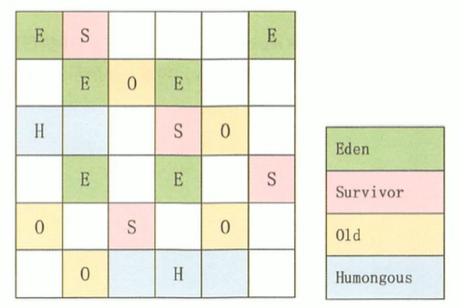

## 3 垃圾回收相关概念

### 3.1 System.gc() 理解

在默认情况下，通过 `System.gc()` 或者 `Runtime.getRuntime().gc()` 的调用，**会显式触发Full GC**, 同时对老年代和新生代进行回收，尝试释放被丢弃对象占用的内存。 

然而 `System.gc()` 调用附带一个免责声明,无法保证对垃圾收集器的调用。

JVM实现者可以通过 `System.gc()` 调用来决定JVM的GC行为。而一般悄况下,垃圾回收应该是自动进行的，无须手动触发。在一些特殊情况下，如我们正在编写一个性能基准，我们可以在运行之间调用 `System.gc()`。 

```java
public class SystemGCTest {
    public static void main(String[] args) {
        new SystemGCTest();
        System.gc(); // System.gc 调用附带一个免责声明,无法保证对垃圾收集器的调用
        System.runFinalization(); // 强制调用失去引用对象的 finalize 方法
    }

    @Override
    protected void finalize() throws Throwable {
        System.out.println("SysemGCTest finalize");
    }

}
```

### 3.2 内存溢出与内存泄漏

#### **内存溢出**

javadoc 中对 OutOfMemoryError 的解释是，**没有空闲内存，并且垃圾收集器也无法提供更多内存。**

没有空闲内存的两种情况：

1. Java虚拟机的堆内存设置不够
2. 代码中创建了大量大对象，并且长时间不能被垃圾收集器收集（存在被引用）


#### **内存泄漏**

严格意义上讲：**只有对象不会再被程序用到了，但是GC又不能回收他们的情况，才叫内存泄漏。**

宽泛意义上讲：很多时候一些不太好的时间（或疏忽）会导致**对象的生命周期变得很长**甚至导致OOM。例如，可以定义为局部变量的对象使用静态变量或者成员变量替代。

例子：

1. 单例模式

单例的声明周期和应用程序是一样长的，所以单例程序中，如果持有对外部对象的引用的话，那么这个外部对象是不能被回收的，则会导致内存泄漏的产生。

2. 提供close的资源未关闭导致内存泄露

数据库连接（dataSource.getConnection()），网络连接（socket）和IO连接必须手动close，否则是不能被回收的。

### 3.3 Stop The World

Stop The World，简称STW，指的是GC事件发生过程中，会产生应用程序的停顿。停顿产生时整个应用程序线程都会被暂停，没有任何响应。

STW会导致所有Java执行线程停顿，原因是分析工作必须在一个能够确保一致性的快照中进行，一致性指分析期间整个执行系统看起来像被冻结在某个时间点上。**如果在分析过程中对象引用关系还在不断变化（GC Roots的变化导致的），则分析结果的准确性无法保证**。

被STW中断的应用程序会在完成GC之后恢复，频繁中断会让用户感觉到明显的卡断，所以我们要减少STW的发生。

- 所有GC都会发生STW事件，但是伴随着垃圾回收器的越来越优秀，回收效率越来越高，尽可能地缩短了暂停时间。
- STW是JVM在后台自动发起和自动完成的。在用户不可见的情况下，把用户正常的工作线程全部停掉。
- 开发中不要用System.gc() 会导致 STW 的发生

### 3.4 垃圾回收的并行与并发

并行（Parallel）：指多条垃圾收集线程并行工作，但此时用户线程仍处于等待状态。
    - 如ParNew，Parallel Scavenge，Parallel Old
串行（Serial）：
    - 相较于并行的概念，单线程执行
    - 如果内存不够，则程序暂停，启动JVM垃圾回收器进行垃圾回收。回收完，再启动程序的线程。
并发（Concurrent）：指用户线程与垃圾收集线程同时执行（但不一定是并行的，可能会交替执行），垃圾收集线程在执行时不会停顿用户程序的运行
    - 用户程序在继续运行，而垃圾收集程序运行于另一个CPU上
    - 如：CMS、G1

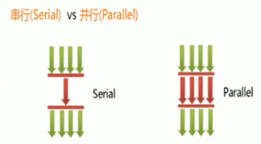

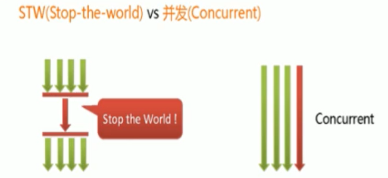

### 3.5 安全点与安全区域

#### **安全点**

程序执行时并非在所有地方都能停顿下来开始GC，只有在特定的位置才能停顿下来开始GC，这些位置称为”安全点（Safepoint）“。

Safepoint的选择很重要，**如果太少可能导致GC等待时间太长**，**如果太频繁可能导致运行时的性能问题**。

大部分指令的执行时间都非常短暂，通常会根据”**是否具有让程序长时间执行的特征**”为标准。比如选择一些执行时间较长的执行作为Safepoint，如**方法调用**、**循环跳转**和**异常跳转**等。

如何在GC发生时，检查所有线程都跑到最近的安全点停顿下来呢？

- 抢先式中断

首先中断所有线程。如果还有线程不在安全点，就恢复线程，让线程跑到安全点。种方式频繁地线程切换，性能差，已经没有虚拟机采用了。

- 主动式中断

设置一个中断标志，各个线程运行到safepoint的时候主动轮询这个标志，如果中断标志为真，则将自己进行中断挂起。

#### **安全区域**

程序有的时候可能“不执行”，比如线程处于Sleep状态或者Blocked状态，这个时候线程无法运行到 Safepoint 来轮询 JVM 的中断标志。对于这种情况，就需要安全区域（Safe Region）来解决。

**安全区域是指一段代码片段中，对象的引用关系不会发生变化，在这个区域中的任何位置开始GC都是安全的。**我们可以把Safe Region看作是被拓展了的safepoint。

### 3.6 引用

#### **强引用（Strong Reference）**

最传统的”引用“的定义，是指在程序代码之中普遍存在的引用复制，即类似 `Object obj = new Object();` 这种引用关系。**无论任何情况下，只要强引用关系还存在，垃圾收集器就永远不会回收掉被引用的对象。**（死也不回收）

强引用的对象是**可触及的**，垃圾收集器就是永远不会回收掉被引用的对象。相对的，软引用、弱引用和虚引用的对象都是软可触及、若可触及和虚可触及的，在一定条件下，都是可以被回收的。所以，强引用是造成Java内存泄露的主要原因之一。

特点：

- 强引用可以直接访问目标对象
- 强引用所指向的对象在任何时候都不会被系统回收，虚拟机宁愿抛出OOM异常，也不会回收强引用所指向对象
- 强引用可能导致内存泄漏

#### **软引用（Soft Reference）**

在系统将要发生内存溢出之前，将会把这些对象列入回收范围之中进行二次回收。如果这次回收后还没有足够的内存，才会抛出内存溢出异常。（内存不足再回收）

软引用通常用来实现内存敏感的缓存。比如：高速缓存就有用到软引用。如果还有空闲内存，就可以暂时保留缓存，当内存不足时清理掉，这样就保证了使用缓存的同时，不会耗尽内存。

#### **弱引用（Weak Reference）**

只被弱引用关联的对象只能生存到下一次垃圾收集之前。当垃圾收集器工作时，无论内存空间是否足够，都会被回收掉弱引用关联的对象。（发现即回收）

#### **虚引用（Phantom Reference）**

一个对象是否有虚引用的存在，完全不会对其生存时间构成影响，也无法通过虚引用来获得一个对象的实例。为一个对象设置虚引用关联的**唯一目的就是能在这个对象被收集器回收时收到一个系统通知**。（对象回收跟踪）

如果一个对象仅持有一个虚引用，那么它和没有引用几乎是一样的，随时都可能被垃圾回收器回收。

它**不能单独使用**，也**无法通过虚引用来获取被引用的对象**。当试图通过虚引用的get方法获取对象时，总是null。为一个对象设置虚引用关联的唯一目的在于**跟踪垃圾回收过程**。比如：能在这个对象被收集器回收时收到一个系统通知。

虚引用必须和引用队列一起使用。虚引用在创建时必须提供一个引用队列作为参数。当垃圾回收器准备回收一个对象时，如果发现它还有虚引用，就会在回收独享后，将这个虚引用加入引用队列，以通知应用程序对象的回收情况。

## 4 垃圾回收器

### 4.1 GC 分类与性能指标

#### **分类**

按**线程数**分，可以分为**串行垃圾回收器**和**并行垃圾回收器**。

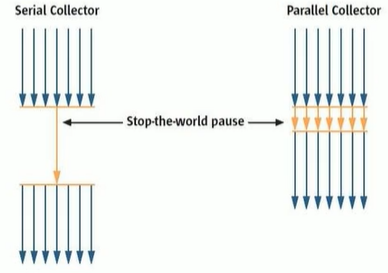

串行回收指的是在同一时间段内只允许有一个CPU用于执行垃圾回收操作，此时工作线程被暂停，直至垃圾收集工作结束。在诸如单核CPU处理器或者较小应用内存等硬件平台不是特别优越的场合，串行收集器的性能表现可以超过并行回收器和并发回收器。

和串行回收相反，并行收集器可以运行多个CPU同时执行垃圾回收，因此提升了应用的吞吐量，不过并行回收仍然与串行回收一样，采用独占式，使用了 STW 机制。

按照**工作模式**分，可以分为**并发式垃圾回收器**和**独占式垃圾回收器**

- 并发式垃圾回收器与应用程序交替工作，以尽可能减少程序的停顿时间。
- 独占式垃圾回收器一旦运行，就停止应用程序中的所有用户线程，直到垃圾回收过程完全结束。


按**碎片处理方式**分，可分为**压缩式垃圾回收器**和**非压缩式垃圾回收器**

- 压缩式垃圾回收器会在回收完成后，对存活对象进行压缩整理，消除回收后的碎片
    - 再分配对象使用**指针碰撞**
- 非压缩式的垃圾回收器不进行这步操作
    - 再分配对象使用**空闲列表**

按**工作的内存区间**分，又可分为**年轻代垃圾回收器**和**老年代垃圾回收器**。

#### **性能指标**

- **吞吐量**：运行用户代码的时间占总运行时间的比例，即**吞吐量 = 运行用户代码时间 / (运行用户代码时间 + 垃圾收集时间)**。高吞吐量的应用程序有更长的时间基准，快速响应是不必考虑的。
    - 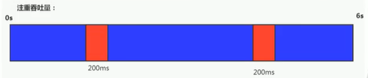
- 垃圾收集开销：吞吐量的补数，垃圾收集所用的时间与总运行时间的比例。 
- **暂停（延迟）时间**：执行垃圾收集时，程序的工作线程被暂停，让GC线程执行的状态
    - 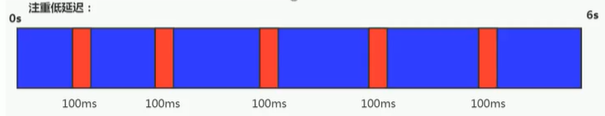
- 收集频率：相对于应用程序的执行，收集操作发生的频率
- **内存占用**：Java堆区所占的内存大小
- 快速：一个对象从诞生到被回收所经历的时间

关系：内存越大，收集频率越低，吞吐量越高，但是暂停时间会变长，延迟越高

目标：**在最大吞吐量优先的情况下，降低暂停时间**

### 4.2 不同的垃圾回收器概述

7款经典垃圾收集器

- 串行回收器：Serial，Serial Old
- 并行回收器：ParNew，Parallel Scavenge，Parallel Old
- 并发回收器：CMS，G1

7款经典垃圾收集器和垃圾分代之间的关系

新生代收集器：Serial、ParNew、Parallel Scavenge
老年代收集器：Serial Old、Parallel Old、CMS
整堆收集器：G1

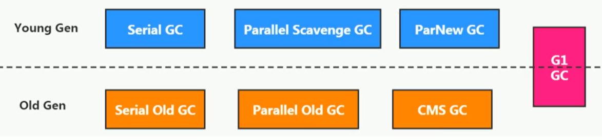

垃圾回收器的组合关系

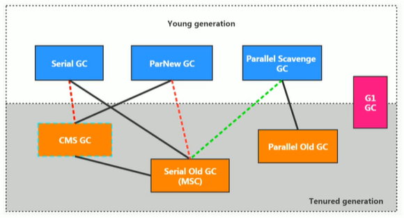

红虚线：JDK8，9的变化
绿虚线：JDK14的变化

查看默认的垃圾收集器

- 通过 `-XX:+PrintCommandLineFlags`：查看命令行相关参数（包含使用的垃圾收集器）
- 使用命令行指令：`jinfo -flag 相关垃圾回收器参数 进程ID` 查看Java进程是否使用对应的垃圾收集器。

- **JDK8**的默认垃圾收集器是 **Parallel Scavenge（新生代）** 和 **Parallel Old（老年代）**
- **JDK11**的默认垃圾收集器是 **G1**

### 4.3 Serial 回收器：串行回收

Serial收集器是最基本、历史最悠久的垃圾收集器。JDK1.3之前回收新生代唯一的选择。

*Serial收集器*作为Hotspot中Client模式下的默认新生代垃圾收集器。

Serial 收集器集采用**复制算法**、**串行回收**和**STW机制**的方式执行内存回收

除了年轻代之外，Serial收集器还提供用于执行老年代垃圾收集的 Serial Old 收集器。*Serial Old 收集器*同样也采用了**串行回收**和**STW机制**，只不过内存回收算法使用的是**标记-压缩算法**。
    
- Serial Old是运行在Client模式下默认的老年代的垃圾回收器
- Serial Old在Server模式下主要有两个用途：①与新生代的Parallel Scavenge配合使用②作为老年代CMS收集器的后备垃圾收集方案 

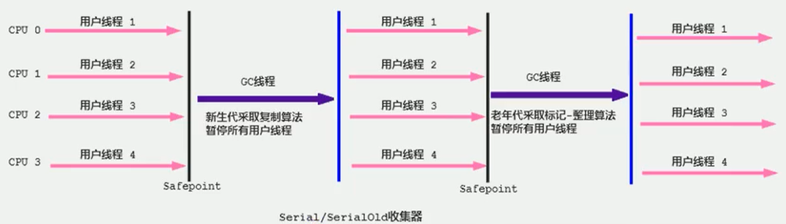

优势：

简单而高效（与其他收集器的单线程相比），对于限定单个CPU的环境来说，Serial收集器由于没有线程交互的开销，专心做垃圾收集自然可以获得最高的单线程收集效率。


### 4.4 ParNew 回收器：并行回收

如果说Serial GC是年轻代中的单线程垃圾收集器，那么ParNew 收集器则是Serial收集器的**多线程版本**。Par是Parrallel的缩写，New是只能处理的是新生代。ParNew 收集器除了采用**并行回收**的方式执行内存回收外，和Serial垃圾收集器相比几乎没有任何区别。ParNew 收集器在年轻代中同样也是采用**复制算法**，**STW机制**。

ParNew 是很多JVM运行在Server模式下新生代的默认垃圾收集器。

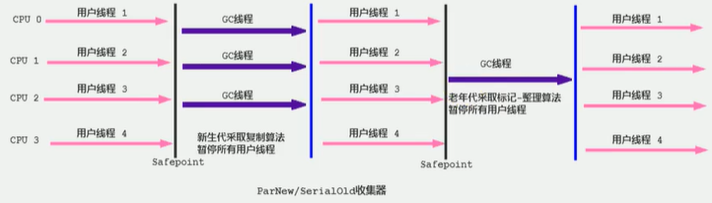

- 对于新生代，回收次数频繁，使用并行方式更高效
- 对于老年代，回收次数较少，使用串行方式节省资源（单核CPU并行回收需要切换线程，串行可以省去切换线程的资源）

### 4.5 Parallel 回收器：吞吐量优先

HotSpot 的年轻代中除了拥有ParNew 收集器是基于并行回收的以外，Parallel Scavenge收集器同样也采用了**复制算法**、**并行回收**和**STW机制**。

那么Parallel收集器的出现是否是多此一举？

- 和ParNew收集器不同，Parallel Scavenge收集器的目标则是达到一个可控制的吞吐量（Throughput），它也被称为吞吐量优先的垃圾收集器。
- 自适应调节策略也是Parallel Scavenge与ParNew一个重要区别

高吞吐量主要**适合后台运算而不需要太多交互的任务**。

Parallel 收集器在JDK1.6 时提供了用于执行老年代垃圾收集的Parallel Old收集器，用来代替老年代的Serial Old 收集器。Parallel Old收集器采用了**标记-压缩**算法，但同样也是基于**并行回收**和**STW机制**。


### 4.6 CMS 回收器：低延迟

CMS（Concurrent-Mark-Sweep）收集器时HotSpot虚拟机中第一款真正意义上的并发收集器，它第一次实现了让垃圾收集线程与用户线程同时工作。

CMS收集器的关注点是尽可能缩短垃圾收集时用户线程的停顿时间。停顿时间越短（低延迟）就越适合与用户交互，良好的响应速度能提升用户体验。

CMS的垃圾收集器采用**并发回收**，**标记-清除算法**，并且也有**STW机制**。

CMS作为老年代的收集器无法与JDK1.4.0中已经存在的新生代收集器Parallel Scavenge配合工作，所以JDK1.5中使用CMS来收集老年代的时候，新生代只能选择ParNew或者Serial收集器中的一个。

#### **工作原理**

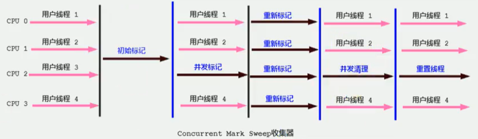

CMS过程主要分为4个阶段：**初始标记阶段**，**并发标记阶段**，**重新标记阶段**和**并发清楚阶段**。

- 初始标记（Initial-Mark）阶段：这个阶段中，程序中所有的工作线程都将会因为STW机制出现短暂的暂停，这个阶段的主要任务仅仅只是**标记出GC Roots能直接关联到的对象**。一旦标记完成之后就会恢复之前被暂停的所有引用线程。由于直接关联对象比较小，所以**速度非常快**。
- 并发标记（Concurrent-Mark）阶段：从GC Roots的**直接关联对象开始遍历整个对象图的过程**，这个过程**耗时较长但是不需要停顿用户线程**，可以与垃圾收集线程一起并发运行。
- 重新标记（Remark）阶段：由于在并发标记阶段中，程序的工作线程会和垃圾收集线程同时运行或者交叉运行，该阶段用于**修正并发标记期间，因用户程序继续运行而导致标记产生变动的那一部分对象的标记记录**。这个阶段的停顿时间通常会比初始标记阶段稍长一些，但也远比并发标记阶段的时间段。
- 并发清理（Concurrent-Sweep）阶段：此阶段**清理删除掉标记阶段判断为已经死亡的对象，释放内存空间**。由于不需要移动存活对象，所以这个阶段也是可以与用户线程同时并发的。

#### **低延迟**

尽管CMS收集器采用的是并发回收（非独占式），但是在其**初始化和再标记这两个阶段中仍然需要执行STW机制暂停程序中的工作线程**，不过暂停时间不会太长，因此可以说明目前所有的垃圾收集器都做不到完全不需要STW，只能尽可能地缩短暂时间。由于最耗时的并发标记与并发清除都不需要暂停工作，所以整体的回收是**低延迟**的。

#### **内存空间不足**

另外，由于在垃圾收集阶段用户线程没有中断，所以**在CMS回收过程中，还应该确保应用程序用户线程有足够的内存可用**。CMS收集器不能像其他收集器那样等到老年代几乎完全填满了再进行收集，而是**当对内存使用率达到某一阈值时，便开始进行回收**，以确保应用程序在CMS工作过程中仍然有足够的空间支持应用程序运行。要是CMS运行期间预留的内存无法满足程序需要，就会出现一次 Concurrent Mode Failure 失败，这是虚拟机将启动**后备方案**：临时启用 Serial Old 收集器来重新进行老年代的垃圾收集，这样停顿时间就很长了。

#### **CMS的标记-清除算法**

CMS收集器采用的时**标记-清除算法**，这意味着每次执行完内存回收后，由于被执行内存回收的无用对象所占用的内存空间极有可能是**不连续的一些内存块**，不可避免地将会产生一些内存碎片。那么CMS在为新对象分配内存空间时，**将无法使用指针碰撞技术，只能使用空闲列表来进行内存分配**。

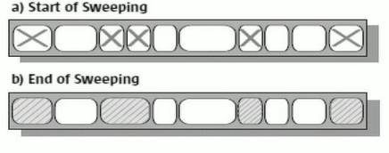

那为什么不把笔记清除算法改为标记压缩算法呢？

因为并发清除的时候，因为并发运行的用户线程正在使用内存资源，所以不能用Compact对内存进行整理。如果要进行Mark Compact更适合STW这种场景下。


#### **优点**

- 并发收集
- 低延迟

#### **缺点**

1. **会产生内存碎片**，导致并发清除后，用户线程可用空间不足。无法分配大对象的情况下，不得不提前出发Full GC。
2. **CMS收集器对CPU资源非常敏感**。在并发阶段，他虽然不会导致用户停顿，但是会因为占用了一部分线程而导致应用程序变慢，总吞吐量降低。
3. **CMS收集器无法处理浮动垃圾**。在并发标记阶段由于程序的工作线程和垃圾收集线程是同时运行或者交叉运行的，那么在**并发标记阶段如果产生了新的垃圾对象，CMS将无法对这些垃圾对象进行标记，最终会导致这些新产生的垃圾对象没有被及时回收**，从而只能在下一次执行GC时释放这些之前为被回收的内存空间。


#### **小结**

最小化地使用内存和并行开销：Serial GC
最大化应用程序的吞吐量：Parallel GC
最小化GC的中断或停顿时间：CMS GC

### 4.7 G1回收器：区域划分代式

G1（Garbage-First）是一款面向服务端应用的垃圾收集器，**主要针对配备多核CPU及大容量内存的机器**，以极高概率满足GC停顿时间的同时，还兼具高吞吐量的性能特性。

G1是一个并行回收器，它把堆内存分割成很多不相关的区域（Region）（物理上不连续的）。使用不同的Region来表示Eden、幸存者0区，幸存者1区，老年代等。

G1 GC有计划地避免在整个Java堆中进行全区域的垃圾收集。G1跟踪各个Region里面的垃圾堆积的价值大小（回收所获得的空间大小以及回收所需时间的经验值），在后台维护一个优先列表，**每次根据允许的收集时间，优先回收价值最大的Region。**

由于这种方式的侧重点在于回收垃圾最大量的区间（Region），所以我们给G1一个名字：垃圾有限（Garbage First）。

#### **优点**

- **并行与并发**
    - 并行性：G1在回收期间，可以有多个GC线程同时工作，有效利用多核计算能力。此时用户线程STW
    - 并发性：G1拥有与应用程序交替执行的能力，部分工作可以和应用程序同时执行，因此，一般来说，不会在整个回收阶段发生完全阻塞应用的情况。
- **分代收集**
    - 从分代上看，**G1依然属于分代型垃圾回收器**，它会区分年轻代和老年代，年轻代依然有Eden区和Survivor区。但从堆的结构上看，他不要求整个Eden区、年轻代或者老年代都是连续的，也不再坚持固定大小和固定数量。
    - 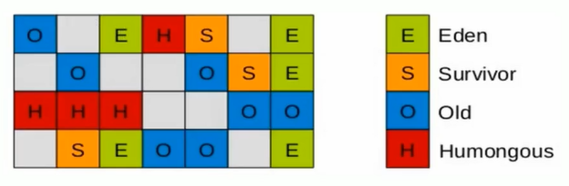
    - **将堆空间分为若干个区域（Region），这些区域中包含了逻辑上的年轻代和老年代**
    - 和之前的各类回收器不同，它同时**兼顾年轻代和老年代**。
- **空间整合**
    - CMS：“标记-清除”算法、内存碎片、若干次GC后进行一次碎片整理。
    - G1将内存划分为一个个的Region。内存的回收是以Region作为基本单位的。**Region之间是复制算法**，但是**整体上实际可看作是标记-压缩（Mark-Compact）算法**，两种算法都可以避免内存碎片。这种特性有利于程序长时间运行，分配大对象不会因为无法找到连续内存空间而提前触发下一次GC。尤其时当Java堆非常大的时候，G1的优势会更加明显。
- **可预测的停顿时间模型**（即：软实时soft real-time）
    - G1收集器还能建立可预测的停顿时间模型，能让使用者明确指定一个长度为M毫秒的时间段内，消耗在垃圾收集上的时间不找过N毫秒
    - 由于分区的原因，G1可以只选取部分区域进行内存回收，这样缩小了回收的范围，因此对于全局停顿的情况的发生也能得到较好的控制。
    - G1跟踪各个Region里面的垃圾堆积的价值大小（回收所获得的空间大小以及所收集所需时间的经验值），在后台维护一个优先列表，每次根据允许的收集时间，优先回收价值最大的Region。保证了G1收集器在有限的时间内可以获取尽可能高的收集效率。

#### **缺点**

相较于CMS，G1还不具备全方位、压倒性优势。比如在用户程序运行过程中，G1无论是为了垃圾收集产生的内存占用（Footprint）还是程序运行时的额外执行负载（Overload）都要比CMS要高

从经验上来说，在小内存应用上CMS的表现大概率会优于G1，而G1在大内存应用上则发挥其优势。平衡点在6-8GB之间。

#### **分区Region 化整为零**

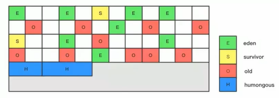

使用G1收集器时，它将整个Java堆划分为越2048个大小相同的独立Region块，每个Region块大小根据堆空间的实际大小而定，整体被控制在1MB到32MB之间，且为2的N次幂，即1MB，2MB，4MB，8MB，16MB，32MB。可以通过 `-XX:G1HeapRegionSize` 设定。**所有的Region大小相同，且在JVM声明周期内部会被改变。**

一个region只可能属于Eden，Survivor或者Old/Tenured 内存区域。但是一个region只可能属于一个角色。Region在清空后有可能会转变角色。

G1垃圾收集器还增加了一种叫做Humongous内存区域，主要用于存储大对象，如果超过1.5个region就放到该区域中。

对于堆中的大对象，默认会直接分配到老年代，但是如果他是一个短期存在的大对象，就会给垃圾收集器造成负面影响。为了解决这个问题，G1划分了一个Humongous区，让它专门存放大对象。如果一个H区装不下一个大对象，那么G1会寻找连续的H区来存储。为了能找到连续的H区，有时候不得不启动Full GC。**G1的大多数行为都把H区作为老年代的一部分来看待。**

#### **Remembered Set**

问题：

一个region不可能时孤立的，一个region中的对象可能被其他任意region中的对象引用，判断对象存活时，是否需要扫描整个Java堆才能保证准确？

解决方法：


- 无论G1还是其他分代收集器，JVM都是使用Rememered Set来避免全局扫描。
- 每个Region都有一个对应的Remembered Set。
- 每次Reference类型数据写操作时，都会产生一个Write Barrier暂时中断操作，然后检查要写入的引用指向对象是否和该Reference类型数据在不同的region，如果不同，通过CardTable把相关引用信息记录到引用指向对象所在region对象的remembered set中。当进行垃圾收集时，在GC根节点的枚举范围加入Remembered set，就可以保证不进行全局扫描，也不会有遗漏。

#### **回收过程**

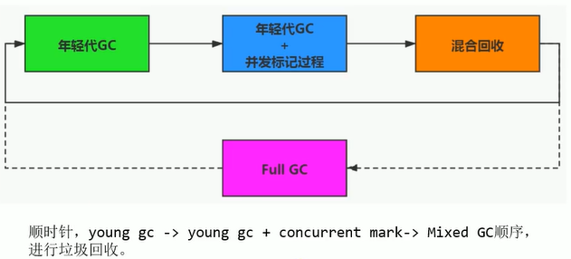

1. **年轻代GC（Young GC）**

应用程序分配内存，**当年轻代的Eden区用尽时**开始年轻代回收过程：G1的年轻代收集阶段是一个**并行**的**独占式**收集器。在年轻代回收期，G1 GC暂停所有应用程序线程，启动多线程执行年轻代回收。然后从**年轻代区间移动存活对象到Survivor区间或者老年区间，也有可能是两个区间都会涉及**

YGC时，首先G1停止应用程序的执行，G1创建**回收集（Collection Set）**，回收集是指需要被回收的内存分段的集合，年轻代回收过程的回收集包含年轻代Eden区和Survivor区所有的内存分段。


2. **老年代并发标记过程（Concurrent Marking）**

当堆内存使用达到一定值（**默认45%**）时，开始老年代并发标记过程。


总结：
- YGC
- 并发标记（百分百垃圾Region被回收）计算Regin活性，因为是并发进行所以还还需要修正标记结果，修正过程是STW的
- 根据Region活性和GC回收的比例堆Region进行排序，为混合回收做铺垫

3. **混合回收（Mixed GC）** 年轻代和老年代共同回收

**标记完成马上开始混合回收过程**。对于一个混合回收器，G1 GC从老年代移动存活对象到空闲区间，这些空闲区间也就成为了老年代的一部分。和年轻代不同，老年代的G1回收器和其他GC不同，**G1的老年代回收器不需要整个老年代被回收，一次只需要扫描/回收一个小部分老年代的Regin就可以了**。同时，这个老年代Region是和年轻代Region一起被回收的。


总结：

混合回收会回收八分之一的老年代Region，所有的Eden区Region和Survivor区Region。老年代种的Region分8次被回收，G1优先回收立即多的Region，垃圾占用Region比例越高月线被回收。

混合回收并不一定要进行8次。有一个阈值 `-XX:G1HeapWastePercent`，默认值为10%。意思是允许整个堆内存中有10％的空间被浪费，意味着如果发现可以回收的垃圾占堆内存的比例小于10%，则不再进行混合回收。因为GC会花费很多的时间但是回收到的内存 却很少。 

4. **强力回收（Full GC）**：如果需要，单线程、独占式、高强度的Full GC还是继续存在的。它针对GC的评估失败提供了一种失败保护机制


### 4.8 垃圾回收器总结

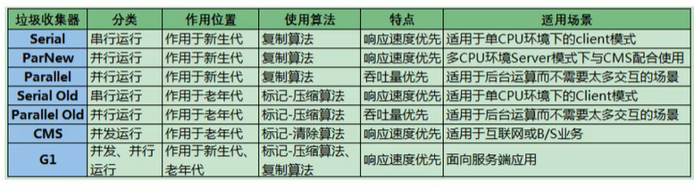

### 4.9 GC日志分析

### 4.10 垃圾回收器的新发展
