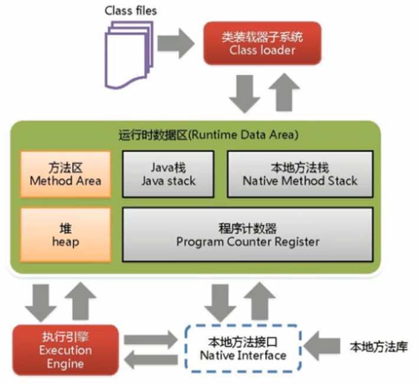

# 1 JVM 和 Java 体系结构

## 1.1 JVM 的整体结构



- 类装载器子系统： 将字节码文件加载到加载到内存当中，生成一个`Class`对象
    - 加载
    - 链接
    - 初始化
- 运行时数据区: 
    - `方法区` 和 `堆` 是多线程共享的
    - `Java栈`, `本地方法栈`和 `程序计数器` 是每个线程单独拥有的
- 执行引擎：将高级语言转换成机器语言
    - 解释器: 解释运行代码, 响应速度快
    - JIT编译器: 热点代码(反复执行的代码)编译成机器指令并缓存到方法区, 执行速度快
    - 垃圾回收器: 垃圾自动回收

## 1.2 JVM 的架构模型

HotSpot虚拟机只有PC寄存器, 任何操作都需要执行入栈和出栈的操作, 是基于栈的指令集架构.

- 基于栈的指令集架构
    - 设计和实现更简单, 适用于资源受限的系统;
    - 避开了寄存器的分配难题; 使用零地址指令方式分配
    - 指令流中的指令大部分是零地址指令, 起执行过程依赖于操作栈. 指令集更小, 编译容易实现.
    - 不需要硬件支持, 可移植性更好, 恒昊实现跨平台.
- 基于寄存器的指令集架构
    - 典型的应用是x86的二进制指令集: 比如传统的PC以及Android的Davlik虚拟机
    - 指令集架构则完全依赖硬件, 可移植性差
    - 性能优秀和执行更高效
    - 操作需要花费的指令少
    - 大部分情况下, 基于寄存器架构的指令集往往都是以一地址指令, 二地址指令和三地址指令为主, 而基于栈的指令集架构却是以零地址指令为主的.

基于栈的指令集架构: 跨平台, 指令集少但指令多, 性能相比于寄存器稍差一些

.class 文件反编译
```
javap -v Class.class
```

## 1.3 JVM 的生命周期

### 1.3.1 虚拟机的启动

Java 虚拟机的启动时通过引导类加载器(bootstrap class loader)创建一个初始类(initial class)来完成的, 这个类是由虚拟机的具体实现指定的.

### 1.3.2 虚拟机的执行

- 一个运行中的Java虚拟机有着一个清晰的任务: 执行Java程序
- 程序开始执行时它才运行,程序结束时它就停止
- 执行一个所谓的Java程序时, 真真正正在执行的是一个叫做Java虚拟机的进程

### 1.3.3 虚拟机的退出

- 程序正常执行结束
- 程序在执行过程中遇到了异常或者错误而异常终止
- 由于操作系统出现错误二导致Java虚拟机进程终止
- 主动结束: 某线程调用System类的exit方法, 或者 Runtime类的halt方法, 兵器Java安全管理器也允许这次exit或halt操作
- JNI(Java Native Interface)规范描述了用JNI Invocation API 来加载或卸载 Java虚拟机时, Java虚拟机的退出情况

## 1.4 JVM 发展历程

1. Sun Classic VM: 第一款商用虚拟机, 只提供解释器, 即时编译器(JIT)可以使用但需要外挂, 只能使用一个, 不能同时使用
2. Exact VM: 可以知道内存中某个位置的数据是什么类型;  热点探测; 编译器和解释器可以混合工作
3. HotSpot VM: 占有绝对的市场地位, Oracle JDK 和 Open JDK 默认的虚拟机
    - 通过计数器找到最具编译价值的代码, 触发即时编译或栈上替换
    - 通过编译器与解释器协同工作, 在最优化的程序响应时间与最佳执行性能中取得平衡
4. JRockit(前BEA 现Oracle): 专注于服务器端应用, 关注启动速度, 不包含及时解释器, 最快的JVM
5. IBM J9:有影响力的三大商用虚拟机之一

