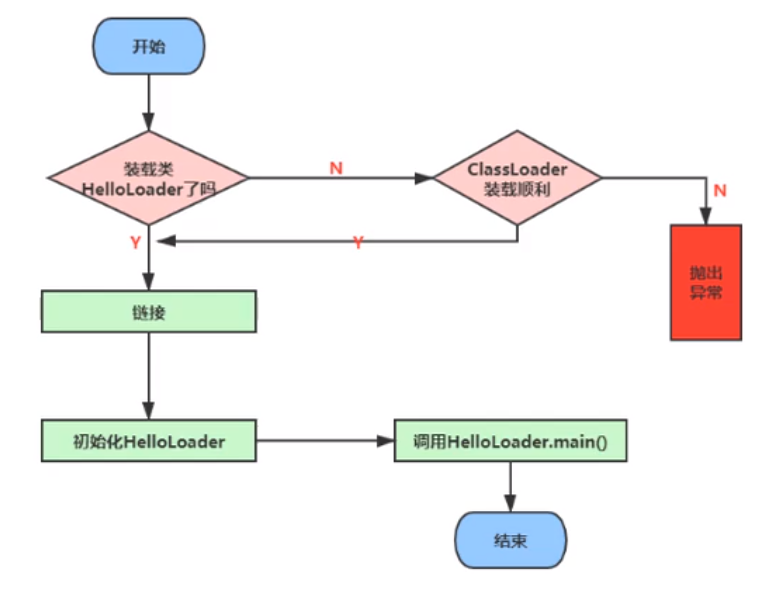

# 2 类加载子系统

## 2.1 作用

类加载子系统负责从文件系统或者网络中加载class文件, class文件在文件开头有特定的文件标识(cafe babe)

ClassLoader 只负责class文件的加载, 至于它是否可以运行, 则由Execution Engine决定.

加载的类信息存放于一块称为方法区的内存空间. 除了类信息外, 方法区中还会存放运行时常量池信息, 可能还包括字符串字面量和数字常量(这部分常量是class文件中常量池部分的内部映射).



## 2.2 加载过程

### 2.2.1 过程一: Loading 加载

1. 通过一个类的全限定名获取定义此类的二进制字节流
2. 将这个字节流所代表的静态存储结构转化为方法区(实现:永久代/元空间)的运行时数据结构
3. 在内存中生成一个代表这个类的java.lang.Class对象,作为方法去这个类的各种数据的访问入口

**加载.class文件的方式**

- 从本地系统中直接加载
- 通过网络获取, 典型场景: Web Applet
- 从zip压缩包中读取, 成为日后jar, war格式的基础
- 运行时计算生成, 使用最多的是: 动态代理技术
- 由其他文件生成, 典型场景: JSP应用
- 从专有数据库中提取.class文件, 比较少见
- 从加密文件中获取, 典型的防class文件被反编译的保护措施

### 2.2.2 类的加载过程二: Linking 链接

#### Verify 验证

- 目的在于确保class文件的字节流中包含信息符合当前虚拟机要求, 保证被加载类的正确性, 不会危害虚拟机自身安全
- 主要包括四种验证: 文件格式验证, 元数据验证, 字节码验证, 符号引用验证

#### Prepare 准备

- 为**类变量**分配内存并设置该类变量的默认初始值, 即零值
- 这里不包含用final修饰的static, 因为final在编译的时候就会分配了, 准备阶段会显式初始化
- 这里不会为实例变量分配初始化, 类变量会分配在方法区中, 而实例变量会随着对象一起分配到Java堆中


#### Resolve 解析

- 将常量池中的符号引用转换为直接引用的过程
- 事实上, 解析操作往往会伴随着JVM在执行完初始化之后在执行
- 符号引用就是一组符号用来描述引用的目标, 符号引用的字面量形式明确定义在《Java 虚拟机规范》的class文件格式中. 直接引用就是直接指向目标的指针, 相对偏移量或者一个间接定位到目标的句柄
- 解析动作主要针对类或接口, 字段, 类方法, 接口方法, 方法类型等, 对应常量池中的CONSTANT_Class_info, CONSTANT_Fieldref_info, CONSTANT_Methodref_info等.

### 2.2.3 过程三: Initialization 初始化

- 初始化阶段就是执行类构造器方法 `<clinit>()` 的过程
- 此方法不需要定义, 是 javac 编译器自动收集类中的所有**类变量**的复制动作和静态代码块中的语句合并而来
- 构造器方法中的指令按语句在源文件中出现的顺序执行
- `<clinit>()` 不同于类的构造器. (关联: 构造器是虚拟机视角下的`<init>()`)
- 若该类具有父类, JVM会保证子类的`<clinit>()`执行前, 父类的`<clinit>()`已经执行完毕
- 虚拟机必须保证一个类的`<clinit>()`方法在多线程下是被同步加锁的

## 2.3 类加载器分类

[深入探讨 Java 类加载器](https://developer.ibm.com/zh/articles/j-lo-classloader/)

类加载器会首先代理给其它类加载器来尝试加载某个类。这就意味着真正完成类的加载工作的类加载器和启动这个加载过程的类加载器，有可能不是同一个。真正完成类的加载工作是通过调用 defineClass 来实现的；而启动类的加载过程是通过调用 loadClass 来实现的。前者称为一个类的定义加载器（defining loader），后者称为初始加载器（initiating loader）。加载的类会把类加载器作为引用作为类型信息保存在方法区中。在 Java 虚拟机判断两个类是否相同的时候，使用的是类的定义加载器。也就是说，哪个类加载器启动类的加载过程并不重要，重要的是最终定义这个类的加载器。两种类加载器的关联之处在于：**一个类的定义加载器是它引用的其它类的初始加载器。**如类 com.example.Outer 引用了类 com.example.Inner ，则由类 com.example.Outer 的定义加载器负责启动类 com.example.Inner 的加载过程。

需要说明一下 Java 虚拟机是如何判定两个 Java 类是相同的。Java 虚拟机不仅要看类的全名是否相同，还要看加载此类的类加载器是否一样。只有两者都相同的情况，才认为两个类是相同的。即便是同样的字节代码，被不同的类加载器加载之后所得到的类，也是不同的。比如一个 Java 类 com.example.Sample ，编译之后生成了字节代码文件 Sample.class 。两个不同的类加载器 ClassLoaderA 和 ClassLoaderB 分别读取了这个 Sample.class 文件，并定义出两个 java.lang.Class 类的实例来表示这个类。这两个实例是不相同的。

类的主动使用和被动使用

主动使用和被动使用的区别就是主动使用在加载类的时候会导致类的初始化, 而被动使用不会导致类的初始化.

- 主动使用(会访问到加载类的静态变量)
    1. 创建类的实例
    2. 访问某个类或接口的静态变量, 或者对该静态变量赋值
    3. 调用类的静态方法
    4. 反射(比如: `Class.forName`)
    5. 初始化一个类的子类(父类要首先被初始化)
    6. Java虚拟机启动时被标名为启动类的类
    7. JDK 7 开始提供的动态语言支持
- 被动使用(不会访问加载类的静态变量)
    1. 当访问一个静态域时, 只有真正声明这个域的类才会被初始化
        - e.g. 通过子类引用父类的静态变量, 不会导致子类初始化
        ```java
        public class Test {
            public static void main(String args[]) {
                System.out.println(B.x); // 值初始化A类
            }
        }

        class A {
            public static int x = 100;
            static {
                System.out.println("静态初始化A");
            }
        }

        class B extends A {
            static {
                System.out.println("静态初始化B");
            }
        }
        ```
    2. 通过数组定义类引用, 不会发生此类的初始化
        ```java
        public class Test {
            public static void main(String args[]) {
                A[] as = new A[10]; // 不会初始化 A 类
            }
        }

        class A {
            public static int x = 100;
            static {
                System.out.println("静态初始化A");
            }
        }

        ```
    3. 引用类的常量(`final` 修饰的变量)