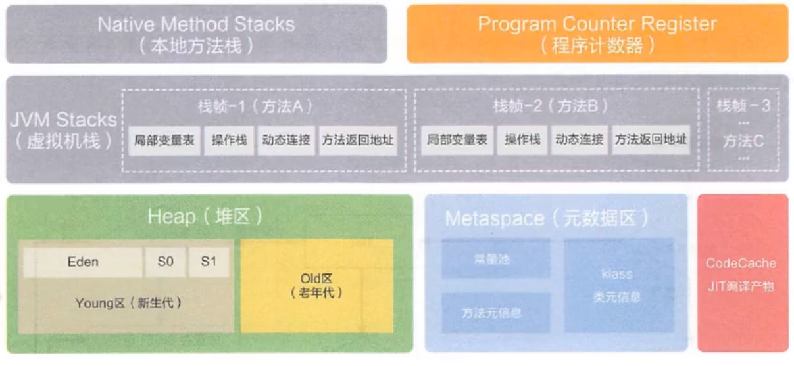
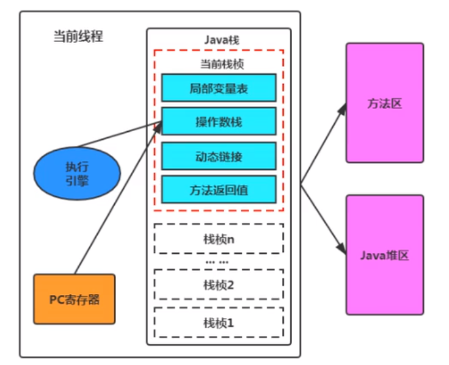
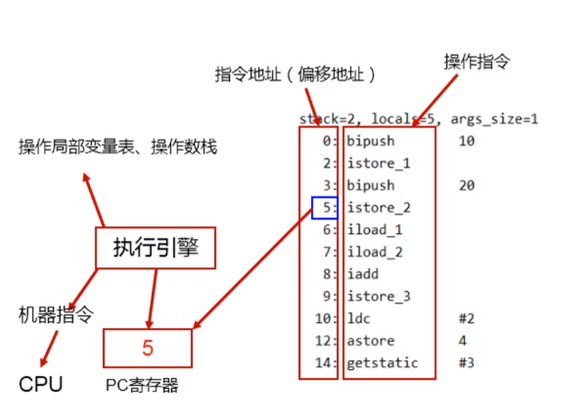
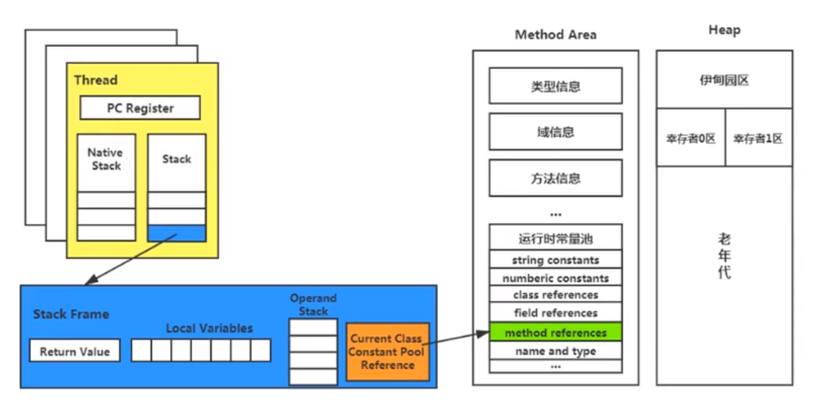

# 3 运行时数据区概述及线程

## 3.1 运行时数据区




Java虚拟机定义类若干种程序运行期间会使用到的运行时数据区, 其中一些会随着虚拟机启动而创建, 随着虚拟机退出而销毁. 如在简图中用红颜色标注的内容.

另外一些则是与线程一一对应, 这些与线程一一对应的数据区会随着县城开始和结束而创建和销毁. 如简图中用灰色标记的内容.

注: 方法区也叫做非堆, 永久代和元空间可以理解为代码的方法区的实现

一个JVM对应一个Runtime实例,  相当于JVM的运行时数据区, 一个虚拟机只有这一份.

## 3.2 线程

线程是一个程序里的运行单元. JVM允许一个应用有多个线程并行的执行

在 Hotspot JVM里, 每个线程都与操作系统的本地线程直接映射.

当一个Java线程准备好执行时, 此时一个操作系统的本地线程也同时创建. Java 线程执行终止后, 本线程也会回收.

操作系统负责所有线程的安排调度到任何一个可用的CPU上, 一旦本地线程初始化成功, 他就会调用Java线程中的run() 方法.

## 3.3 程序计数器(PC寄存器)(运行时数据区)

JVM中的PC寄存器是对物理PC寄存器的一种抽象模拟

PC寄存器用来存储指向下一条指令的地址, 即将要执行的指令代码. 有执行引擎读取下一条指令.



PC寄存器是一块很小的内存空间, 机会可以忽略不计. 也是运行速度最快的存储区域.

在JVM规范中, 每个线程都有让自己的程序计数器, 是线程私有的, 生命周期和线程生命周期保持一致.

任何一个线程都只有一个方法在执行, 也就是所谓的当前方法. 程序计数器会存储当前线程正在执行的Java方法的JVM指令地址; 如果是在执行native方法, 则是未指定值(undefined)

各个线程PC寄存器就是存放下一个指令的地址, 不需要垃圾回收也没有OOM(OutOfMemory).

栈有入栈出栈机制, 不需要垃圾回收, 但是有可能堆栈溢出.

### 3.3.1 例子

```java
package xyz.zerxoi;

public class PCRegister {
    public static void main(String[] args) {
        int i = 10;
        int j = 20;
        int k = i + j;

        String s = "abc";
        
    }
}
```

执行 `javap -v .\xyz\zerxoi\PCRegister.class`

```
....
public static void main(java.lang.String[]);
    descriptor: ([Ljava/lang/String;)V
    flags: (0x0009) ACC_PUBLIC, ACC_STATIC
    Code:
      stack=2, locals=5, args_size=1
         0: bipush        10
         2: istore_1
         3: bipush        20
         5: istore_2
         6: iload_1
         7: iload_2
         8: iadd
         9: istore_3
        10: ldc           #2                  // String abc
        12: astore        4
        14: getstatic     #3                  // Field java/lang/System.out:Ljava/io/PrintStream;
        17: iload_1
        18: invokevirtual #4                  // Method java/io/PrintStream.println:(I)V
        21: getstatic     #3                  // Field java/lang/System.out:Ljava/io/PrintStream;
        24: iload_3
        25: invokevirtual #4                  // Method java/io/PrintStream.println:(I)V
        28: return
...
```



### 3.3.2 常见问题

1. 使用PC寄存器存储字节码指令有什么用呢? / 为什么使用PC寄存器记录当前线程的执行地址呢?

因为CPU需要不停的切换各个线程, 切换回来的时候需要知道从什么位置继续执行, 因此需要PC寄存器记录执行的下一条字节码指令地址.

2. 为什么PC寄存器被设为线程私有的

为了能够准确地记录各个线程正在执行的当前字节码指令地址, 最好的办法自然是为每一个线程都分配一个PC寄存器.

## 3.4 虚拟机栈(运行时数据区)

### 3.4.1  虚拟机栈的概述

#### 出现背景
由于跨平台性的设计, Java的指令都是根据栈来设计的. 不同平台CPU架构不同, 所以不能设计为基于寄存器的. 栈的优点是跨平台, 指令集小, 编译器容易实现; 缺点是性能下降, 实现同样的功能需要更多的指令.

栈是运行时的单位, 而对是存储的单位. 即栈解决程序的运行问题, 及程序如何执行, 或者说如何处理数据; 对解决的是数据存储的问题, 即数据怎么放, 放在哪.

#### 概念

Java虚拟机栈(Java Virtual Machine Stack), 早期也叫Java栈. 每个线程在创建时都会创建一个虚拟机栈, 其内部保存一个个的栈帧(Stack Frame), 对应着一次次的Java方法调用. 我们称栈顶方法为当前方法.

#### 生命周期

Java虚拟机栈的生命周期和线程生命周期一致.

#### 作用

它主管Java程序的运行, 它保存方法的局部变量(8种基本数据类型和对象的引用地址), 部分结果, 并参与方法的调用和返回.

#### 站的特点(优点)

- 站是一种快速有效的分配存储方式, 访问速度仅次于程序计数器.
- JVM直接对Java栈的操作只有两个:
    - 每个方法执行, 伴随着进栈
    - 执行结束后的出栈工作
- 对于栈来说不存在垃圾回收问题(因为有进栈出栈的机制)

#### 可能出现的异常

Java虚拟机规范允许 Java栈的大小是动态的或者是固定不变的.

- 如果采用**固定大小**的Java虚拟机栈, 那每一个线程的Java虚拟机栈容量可以在线程创建的时候独立选定. 如果线程请求分配的栈容量超过Java虚拟机栈允许的最大容量, Java虚拟机就会抛出一个`StackOverflowError`异常
- 如果Java虚拟机栈可以**动态扩展**, 平且在尝试拓展的时候无法盛情到足够的内存, 或者在创建新的线程的时候美欧足够的内存去创建对应的虚拟机栈, 那Java虚拟机将会抛出一个`OutOfMemoryError`异常

#### 虚拟机栈基本内容

- 设置栈内存大小
我们可以使用参数`-Xss`选项来设置线程的最大占空间, 栈的大小直接决定了函数调用的最大可达深度.

### 3.4.2 栈帧 —— 栈的存储单位

- 每个线程都有自己的栈, 栈中的数据都是以栈帧(Stack Frame)的格式存在
- 在这个线程上正在执行的每个方法都各自对应一个栈帧(Stack Frame)
- 栈帧是一个内存区域, 是一个数据集, 维系着方法执行过程中的各种数据信息

- JVM直接对Java栈的操作只有两个, 就是对栈帧的压栈和出栈, 遵循"先进后出"/"后进先出"原则
- 在一条活动线程中, 一个时间点上, 只会有一个活动的栈帧. 即只有当前正在执行的方法的栈帧(栈顶栈帧)是有效的, 这个栈帧被称为**当前栈帧(Current Frame)**, 与当前栈帧对应的方法就是**当前方法(Current Method)**, 定义这个方法的类就是**当前类(Current Class)**
- 执行引擎运行的所有字节码指令只针对当前栈帧进行操作
- 如果在该方法中调用了其他方法, 对应的新的栈帧会被创建出来, 放在站的顶端, 成为新的当前帧

- 不同线程中所包含的栈帧是不允许存在互相引用的, 即不可能在一个引用另外一个线程的栈帧
- 如果当前方法调用了其他方法, 方法返回之际,当前栈帧回传会此方法的执行结果给前一个栈桢, 虚拟机会丢弃当前栈帧, 使得前一个栈帧重新成为当前栈帧
- Java方法有两种返回函数的方式, 一种是**正常的函数返回**, 使用return指令; 另一种使用**抛出异常**, 不管使用哪种方法, 都会导致栈帧被弹出

每个栈帧中存储着:

- 局部变量表(Local Variables)
- 操作数栈(Operand Stack) (或表达式栈)
- 动态链接(Dynamic Linking (或指向运行时常量池的方法引用)
- 方法返回地址(Return Address) (或方法正常退出或者异常退出的定义)
- 一些附加信息

注: 后三个组成部分统称为帧数据区


#### 局部变量表(Local Variable Table)

- 局部变量表也被称之为局部变量数组或者本地变量表
- 定义为一个数字数组, 主要用于存储方法阐述和定义在方法体内的局部变量, 这些数据类型包括各种**基本数据类型, 对象引用(reference), 以及returnAddress类型**
- **局部变量表所需的容量大小实在编译期确定下来的**, 并保存在方法的code属性的maximum loacl variables数据项中. 在方法运行期间是不会改变局部变量表的大小的.
- 由于局部变量表是建立在线程的栈上, 是现成的私有数据, **因此是不存在数据安全问题的**
- 局部变量表中的变量只在当前方法调用中有效. 在方法执行时, 虚拟机通过使用局部变量表完成参数值到参数变量列表的传递过程. 当方法调用结束后, 随着方法栈桢的销毁, 局部变量表也会随之销毁.

局部变量表的基本单位是Slot(变量槽)

局部变量表中存放编译期可知的各种基本数据类型(8种), 引用类型(reference), returnAddress类型变量

在局部变量表中, **32位以内的类型只占用一个slot(包括returnAddress类型), 64位的类型(long和double)占用两个slot**

当一个实例方法被调用的时候, 他的方法参数和方法体内部定义的局部变量会按照顺序复制到局部变量表的每个slot上

占两个slot的变量使用的是前一个slot的索引

如果当前帧由**构造方法或者实例方法**创建的, 那么该对象引用**this将会存放在index为0的slot处** , 其余的参数将按照参数表顺序继续排序. 这也是为什么静态方法不能使用this变量, 因为当前方法的局部变量表中不存在this

**slot重复利用**: 栈帧中的局部变量表中的槽位是可以重复利用的, 如果一个局部变量过了其作用域, 那么在其作用域之后申明的新的局部变量就很有可能会复用过期的局部变量的槽位, 从而达到节省资源的目的.

```java
class Test {
    public Test() {
        int a = 1;
        {
            int b = 2;
            a += b;
        }
        int c = a;
    }
}
```

这是Test类的构造器, 构造器方法的局部变量表中正常情况下应该有 `this`, `a`, `b`, `c`. 4个slot, 但是由于变量b失效早, 新声明的c变量会复用过期的b变量的局部变量slot. 英雌只需要3个slot即可. 

**静态变量与局部变量对比**

变量的分类:

- 按照数据类型分类:
    - 基本数据类型
    - 引用数据类型
- 按照在类中声明的位置分类:
    - 成员变量: 在使用前都经过默认初始化赋值
        - 类变量(静态变量): Linking 的 prepare 阶段, 给类变量默认赋值; 在 initialization 阶段显式赋值及静态代码块赋值
        - 实例变量: 随着对象的创建, 会在对空间中分配实例变量空间, 并默认赋值
    - 局部变量: 在使用前必须要显式赋值, 否则编译不通过

**补充**

在栈桢中, 与性能调优关系最为密切的部分是前面提到的局部变量表. 在方法执行时, 虚拟机使用局部变量表完成方法的传递.

**局部变量表中的变量也是重要的垃圾回收根节点**, 只要被局部变量表中直接或间接引用的对象都不会被回收.

#### 操作数栈(Operand Stack)

每一个独立的栈帧中除了包含局部变量表以外, 还包含一个后进先出(Last-In-First-Out)的操作数栈, 也可以称之为表达式栈(Expression Stack).

操作数栈, 在方法的执行过程中, 根据字节码指令, 往栈中写入数据或提取数据, 即入栈(push)/出栈(pop)

某些字节码指令会将值压入操作数栈, 其余的字节码指令会将操作数取出栈. 使用它们后再把结果压入栈.

操作数栈, **主要用于保存计算过程中的中间结果, 同时作为计算中变量临时的存储空间.**

操作数栈就是JVM执行引擎的一个工作区, 当一个方法刚开始执行的时候, 一个新的栈帧也会随之被创建, **这个方法的操作数栈是空的**.

每个操作数栈都会拥有一个明确的栈深度用于存储数值, 其所需的最大深度在编译器就定义好了, 保存在方法的Code属性中, 为max_stack的值.

- 32bit的类型占用一个栈单位深度
- 64bit的类型占用两个站单位深度

**如果被调用的方法带有返回值的话, 其返回值将会被压入当前栈帧的操作数栈中**, 并更新PC寄存器中下一条需要执行的字节码指令.

操作数栈中元素的数据类型必须与字节码指令的序列严格匹配, 这由编译器在编译器期间进行验证, 同时在类加载过程中的类检验阶段的数据流分析阶段要再次验证.

Java虚拟机的解释引擎是**基于栈的执行引擎**, 其中的栈指的就是操作数栈.


push x  将x放入操作数栈栈顶
store_i   栈顶元素保存到保存到局部变量表i索引上
load_i  将局部变量表中i索引添加到操作数栈中
iadd    弹出操作数栈的两个元素求和入栈

#### 动态链接(Dynamic Linking)

每一个栈帧内部都包含一个指向**运行时常量池中该栈帧所属方法的引用**. 包括这个引用的目的就是为了支持当前方法的代码能够实现**动态链接(Dynamic Linking)**. 比如: invokedynamic指令

在Java源文件被编译到字节码文件中时, 所有的变量和方法引用都作为符号引用(Symbolic Reference)保存在class文件的常量池里. 比如: 描述一个方法调用了另外的其他方法时, 就是通过常量池中指向方法的符号引用来表示的, 那么**动态链接的作用就是为了将这些符号引用转换为调用方法的直接引用**.

方法区中的运行时常量池就是将字节码中的常量池加载到方法区中运行时常量池的位置.



#### 方法的调用

在JVM中, 将符号引用转换为调用方法的直接引用与方法的绑定机制有关

- 静态引用
当一个字节码文件被装载进JVM内部时, 如果被调用的目标方法在编译期间可知, 且运行期保持不变时. 这种情况下将调用方法的符号引用替换为直接引用的过程称之为静态链接
- 动态链接
如果被调用的方法在编译期无法被确定下来, 也就是说, 只能够在程序运行期将调用方法的符号引用替换成直接引用, 由于这种引用转换过程具备动态性, 因此也就称之为动态链接.

对应的方法的绑定机制为: 早期绑定(Early Binding)和晚期绑定(Late Binding). **绑定是一个字段, 方法或者类在符号引用被替换为直接引用的过程, 这仅仅发生一次.**

- 早期绑定
早期绑定就是指被动用的目标方法如果在编译期间可知, 且运行其保持不变时, 即可将这个方法与所属的类型进行绑定, 这样一来, 由于明确了被动用的目标方法究竟是哪一个, 因此也就可以使用静态链接的方式将符号引用转为直接引用.
- 晚期绑定
如果被调用的方法在编译器无法被确定下来, 只能够在程序运行期根据实际的类型绑定相关的方法, 这种绑定方式也就被称之为晚期绑定.

e.g.
```java
public class AnimalTest {
    public void showAnimal(Animal animal) {
        // 字节码指令 invokevirtual
        animal.eat(); // 表现为晚期绑定 不确定要调用的方法
    }

    public void showHunt(Huntable h) {
        // 字节码指令 invokeinterface
        h.hunt(); // 表现为晚期邦迪 不确定实现类对象更无法确定嗲用方法
    }
}

interface Huntable {
    void hunt();
}

class Animal {
    public void eat() {
        System.out.println("动物进食");
    }
}

class Dog extends Animal implements Huntable {
    @Override
    public void eat() {
        // 字节码指令 invokespecial
        super.eat(); // 表现为早期绑定 方法确定时 Animal 的 eat 的方法
        System.out.println("狗吃骨头");
    }
    @Override
    public void hunt() {
        System.out.println("狗拿耗子多管闲事");
    }
}

class Cat extends Animal implements Huntable {
    @Override
    public void eat() {
        System.out.println("猫吃鱼");
    }

    @Override
    public void hunt() {
        System.out.println("猫吃耗子天经地义");
    }
}
```

- 非虚方法(确定的调用方法)
    - 如果方法在编译期间就确定了具体的调用版本, 这个版本在运行时是不可变的, 这样的方法称为非虚方法
    - 静态方法, 私有方法, final方法(前三个方法无法被重写), 实例构造器, 父类方法都是非虚方法
    - 其他方法称为虚方法
- 虚方方法: 不确定要调用的具体的方法, 这种情况常常发生在类的继承并重写该方法的时候.

字节码指令

- 普通调用指令
    1. invokestatic 调用静态方法, 解析阶段确定唯一方法版本
    2. invokespecial 调用`<init>`方法(构造器方法), 私有及父类方法, 解析阶段确定唯一方法版本
    3. invokevirtual 调用所有虚方法
    4. invokeinterface 嗲用接口方法
- 动态调用指令
    5. invokedynamic 动态解析出需要调用的方法然后执行(例子:lambda表达式)

前四条指令固化在虚拟机内部, 方法的调用执行不可人为干预, 而invokedynamic指令则支持用户去定方法的版本. **其中invokestatic指令和invokespecial指令的方法称为非虚方法, 其余的(fnial修饰的除外)称为虚方法**

- 动态类型语言
    - 类型检查是在编译期
    - 判断变量自身的类型信息
- 静态类型语言
    - 类型检查是在运行期
    - 判断变量值的类型信息, 变量没有类型信息, 只有变量值才有

方法重写的本质

1. 找到操作数栈顶的第一个元素所执行的对象的实际类型, 记作 C
2. 如果在类型C中找到与常量中描述符符合简单名称都相符的方法, 则进行访问权限校验, 如果通过则返回这个方法的直接引用, 查找过程结束; 如果不通过则返回java.lang.IllegalAccessError异常
3. 否则, 按照继承关系从下往上依次对C的各个父类进行第2步的搜索和验证过程
4. 如果始终没有找到合适的方法, 则抛出 java.lang.AbstractMethodError异常

在面向对象的编程中, 会很频繁的使用到动态分派, 如果在每次动态分派的过程中都要重新在类的方法元数据中搜索合适的目标的话, 会影响到执行效率. 因此, 为了提高效率, JVM采用在类的方法区建立一个虚方法表(Virtual method table)来实现, 使用索引表来代替查找.

虚方法表实在类加载的连接阶段创建并开始初始化, 类的变量初始值准备完成之后, JVM会把该类的放发表也初始化完毕

#### 方法返回地址(Return Address)

存放调用该方法的PC寄存器的值

一个方法的结束有两种方式:

- 正常执行完成
- 出现未处理的异常, 非正常退出

无论通过哪种方式退出, 在方法推出后都要返回带该方法被调用的位置. 方法正常退出时, **调用者的PC计数器的值作为返回地址, 即调用该方法的下一条指令的地址**. 而通过异常退出的, 返回地址要通过异常表来确定, 栈帧中一般不会保存这部分信息.

本质上, 方法的退出就是当前栈帧出栈的过程. 此时, 需要恢复上层方法的局部变量表, 操作数栈, 将返回值压入调用者栈帧的操作数栈, 设置PC寄存器值等, 让蒂埃用这方法继续执行下去.

正常完成出口和一场完成出口的区别在于: 通过异常完成出口退出的不会给他的上层调用者产生任何的返回值.

正常执行完成的指令:

返回值是boolean, byte, char, short 和 int 类型时使用 ireturn 字节码指令
返回值是long对应lreturn, 返回值是float对应freturn, 返回值是引用类型对应areturn
如果是void方法, 实例初始化方法, 类和接口的初始发方法对应的是return

### 回顾总结

方法中定义的局部变量是否线程安全?

如果局部变量存在逃逸, 则不安全

逃逸的情况有变量由参数传入, 或者变量返回可被其他线程操作

## 3.5 本地方法接口

**一个Native Method就是一个Java调用非Java代码的接口.** 一个Native Method 是这样一个Java 方法: 该方法的实现由非Java语言实现, 比如C, 这个特性并非Java所特有, 很多其他的编程语言都有这一机制, 比如在C++中, 可以用 extern "C" 告知C++编译器去调用一个C的函数

再定义一个native method时, 并不提供实现体, 因为其实现体是由非Java语言在外面实现的.

本地接口的作用是融合不同的编程语言为Java所用, 他的初衷是融合C/C++程序

**为什么要使用Native Method?**

Java使用起来非常方便, 然而有些层次的任务用Java实现起来不容易, 或者对程序的效率很在意时, 问题就来了.

- 与Java环境外交互
有时Java应用需要与Java外面的环境交互, 这是本地方法存在的主要原因. Java需要与一些底层系统, 如操作系统或某些硬件交换信息时的情况, 本地方法正是这样一种交流机制: 它为我们提供了一个非常简洁的接口, 而且我们无需去了解Java应用之外的繁琐细节.
- 与操作系统交互
通过使用本地方法, 我们得以用Java实现了JRE的与底层系统的交互, 甚至JVM的一些部分就是用C写的.
- Sun's Java
Sun的解释器是用C实现的, 这使得他能像一些普通的C一样与外部交互.

## 3.6 本地方法栈

Java虚拟机栈用于管理Java方法的调用, 而本地方法栈用于管理本地方法的调用

本地方法栈, 这是线程私有的

允许被实现成固定或者是可动态扩展的内存大小. 如果线程请求分配的栈容量超过本地方法栈允许的最大容量, Java虚拟机将会抛出一个StackOverflowError异常; 如果本地方法栈是可以动态拓展的, 并且在尝试拓展的时候无法申请到足够的内存, 或者在创建新的线程时没有足够的内存去创建对应的本地方法栈, 那么Java虚拟机将会抛出一个OutOfMemoryError异常

本地方法是使用C语言实现的

他的具体做法是Native Method Stack中登记native方法, 在Execution Engine 执行时加载本地方法库.

当某个线程调用了一个本地方法时, 他就进入了一个全新的并且不再受虚拟机限制的世界. 他和虚拟机拥有同样的权限.

- 本地方法可以通过本地方法接口来访问虚拟机内部的运行时数据区
- 他甚至可以直接使用本地处理器中的寄存器
- 直接从本地内存的堆中分配任意数量的内存

