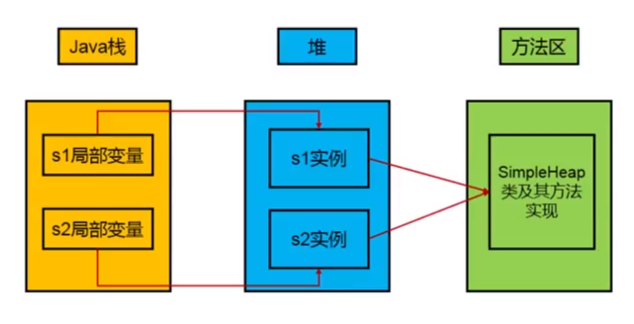
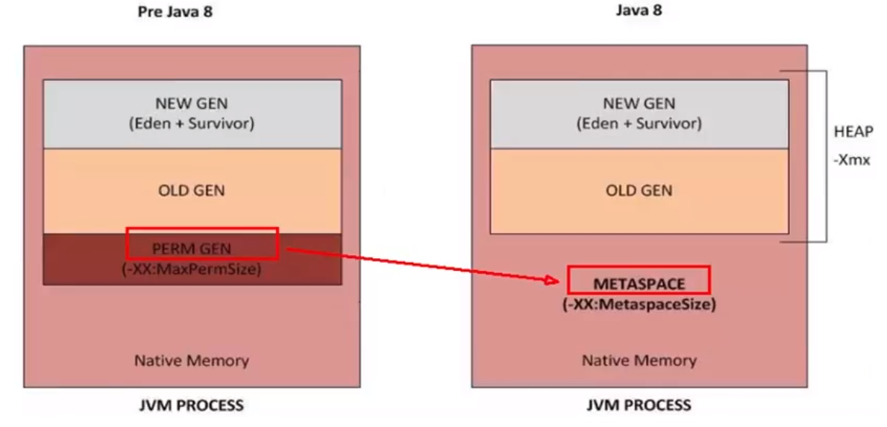
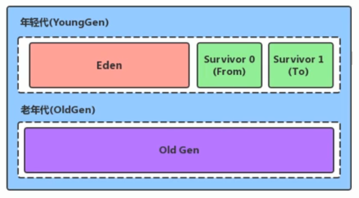
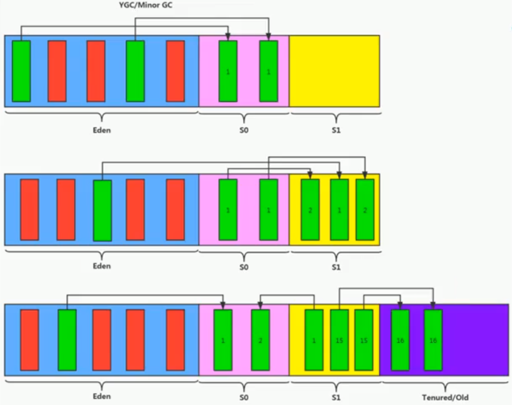
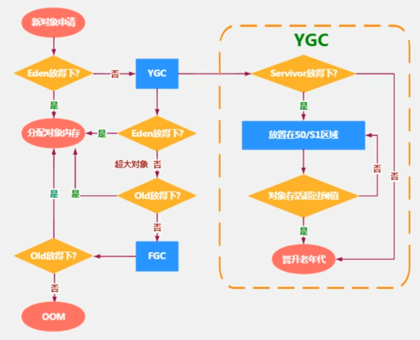
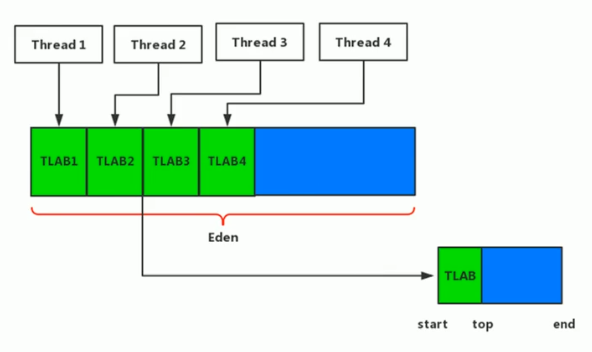
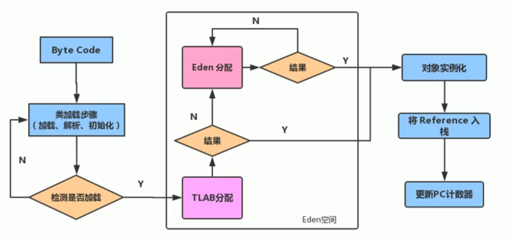

# 堆

## 堆的核心概述

一个JVM实例只存在一个堆内存, 堆也是Java内存管理的核心区域

Java堆区在JVM启动的时候即被创建, 其空间大小也就确定了. 是JVM管理的最大一块空间.

堆内存的大小是可以调节的

《Java虚拟机规范》规定, 推可以处于**物理上不连续**的内存空间中, 但在**逻辑上应该被视为连续的**.

所有的线程共享Java堆, 在这里还可以划分**线程私有的缓冲区(Thread Local Allocation Buffer, TLAB)**, 可以提升并发性

《Java虚拟机规范》中对Java堆的描述是：所有对象实例以及数组都应当在运行时分配在堆上. 但是并不是所有对象的实例都是在堆上分配的, 在堆中放入对象花费时间还要涉及垃圾回收, 在JVM的更新迭代过程中引入了逃逸分析来提升性能, **判断方法中定义的对象有没有发生逃逸， 如果没有发生逃逸可以进行栈上分配**.

数组和对象可能永远不会存储在栈上, 因为栈帧中保存引用, 这个引用指向对象或者数组在堆中的位置.



在方法结束后, 堆中的对象不会马上被移除, 仅仅在垃圾收集的时候才会被移除.

堆是GC(Garbage Collection, 垃圾收集器)执行垃圾回收的重点区域.

## 堆内存的细分

现代垃圾收集器大部分都是基于**分代收集理论**设计, 堆空间细分为:

- JDK 7及之前堆内存逻辑上分为三部分: 新生区+养老区+**永久区**
    - Young Generation Space 新生区 Young/New
        又被划分为Eden区和Survivor区
    - Tenure Generation Space 养老区 Old/Tenure
    - Permanent Space 永久区 Perm
- JDK 8及之后堆内存逻辑上分为三部分: 新生区+养老区+**空间**
    - Young Generation Space 新生区 Young/New
        又被划分为Eden区和Survivor区
    - Tenure Generation Space 养老区 Old/Tenure
    - Meta Space 元空间 Meta

约定

- 新生区 = 新生代 = 年轻代 
- 养老区 = 老年区 = 老年代
- 永久区 = 永久代



## 设置堆内存大小与OOM

Java 堆区用于存储Java对象实例, 那么堆的大小在JVM启动时就已经设定好了, 大家可以通过选项"-Xms"和"-Xms"来进行设置.

注: 设置的堆空间实际上只包含新生代和老年代, 不包含永久代或者还说是元空间.

- `-Xms` 用于表示堆区的起始内存, 等价于 `-XX:InitialHeapSize"`
- `-Xmx`则用于表示堆区的最大内存, 等价于`-XX:MaxHeapSize`

一旦堆区的内存大小超过 `-Xmx` 所指定的最大内存时, 将会抛出`OutOfMemoryError` 异常

默认堆空间的大小

- 初始内存大小: 电脑物理内存大小 / 64
    - 获取方式: `Runtime.getRuntime().totalMemory()`
- 最大内存大小: 电脑物理内存大小 / 4
    - 获取方式: `Runtime.getRuntime().maxMemory()`

实际开发中建议将初始堆内存和最大堆内存设置为相同的值, 避免GC不断调整对内存大小, 给系统造成额外的压力

堆空间分为: 新生代和老年代, 新生代又可细分为伊甸园区和幸存者区, 幸存者区又分为幸存者0区和幸存者1区. 幸存者0区和幸存者1区始终有个空间是空的, 新生代能够放对象的是伊甸园区加一个幸存者区, 这也是为什么`Runtime.getRuntime().totalMemory()`和`Runtime.getRuntime().maxMemory()`比设置参数要小的原因.

如何查看设置的参数:

1. `jps` / `jstat -gc 进程id`
2. `java` 命令加参数 `-XX:+PrintGCDetails`

## 年轻代与老年代

存储在JVM中的Java对象可以被划分为两类:

- 一类是生命周期较短的瞬时对象, 这类对象的创建和消亡都非常迅速
- 另一类对象的生命周期非常长, 在某些极端的情况下还能够与JVM的生命周期保持一致

Java堆区进一步细分的话, 可以划分为年轻代(YoungGen)和老年代(OldGen)

其中年轻代又可划分为Eden空间, Survivor0空间和Survivor1空间(有时也叫做from区, to区)



配置新生代和老年代在堆结构中的占比

- 默认 `-XX:NewRatio=2` 表示老年代和新生代的比值是2, 新生代占整个堆的1/3
- 可以修改 `-XX:NewRatio=4` 表示将老年代和新生代的比值设为4, 新生代占整个堆的1/5
- 在HotSpot中, Eden空间和另外两个Survivor空间缺省所占的比例是8:1:1, 但是实际上可能并不是按照8:1:1的比例, 因为存在自适应的内存分配册率, 可以通过`-XX:-UseAdaptiveSizePolicy`来关闭, 但是关闭好像也没用, 还是老老实实显式设置吧
- 可以通过`-XX:SurvivorRatio`调整这个空间比值, 比如`-XX:SurvivorRatio=8`
- 几乎所有的Java对象都是在Eden区被new出来的
- 绝大部分的Java对象的销毁都是在新生代进行的
    - IBM公司专门研究表明, 新生代中80%的对象都是"朝生夕死"的
- 通过指定`-Xmn`参数设置新生代空间的大小, 如果同时设置了`-XX:NewRatio`和`-Xmn`那么会以`-Xmn`为准, 但是一般不设置该选项

## 图解对象分配过程

为新对象分配内存是一件非常严谨和复杂的任务, JVM的设计者们不仅需要考虑内存的如何分配, 在那里分配等问题, 并且由于内存分配算法与内存回收算法密切相关, 所有还需要考虑GC执行完内存回收后是否会在内存空间中产生内存碎片.



1. new的对象先放到伊甸园区, 此区有大小限制.
2. 当伊甸园区没有足够空间进行分配时, 虚拟机将会发起一次Minor GC(对新生代的垃圾回收), 此伊甸园区中的不再被其他对象所引用的对象进行销毁. 再加载新的对象放到伊甸园区.(优先分配到Eden)
3. 对于伊甸园中的幸存对象, 如果能放入幸存者区则把对象移动至幸存者0区; 如果幸存者区容纳不下, 则直接移动至养老区(大对象直接进入养老区)
4. 如果再次触发垃圾回收, 对伊甸园区和幸存者0区进行收集, 将存活下来的对象放入幸存者1区
5. 如果再次经历垃圾回收, 此时会重新放回幸存者0区, 接着再去幸存者1区
6. 啥时候能去养老区呢? 
    - 设置次数. 默认是15. 当年龄增加到设定值时会晋升到养老区(长期存活的对象分配到老年代). 通过设置参数: `-XX:MaxTenuringThreshold=<N>` 进行设置.
    - 如果Survivor区中相同年龄的所有对象大小的总和大于Survivor空间的一半, 年龄大于或等于该年龄的对象可以直接进入老年代, 无需等到MaxTenuringThreshold中要求的年龄(动态对象年龄判断)

注: Minor GC 是在伊甸园区满的时候触发, 而幸存者区满了并不触发. 但是回收是针对伊甸园区和幸存者区的回收.

- 针对幸存者s0, s1区的总结: 复制之后有交换, 谁空谁是to
- 关于垃圾回收: 频繁在新生区收集, 很少在养老区收集, 几乎不再永久代/元空间收集.

### 特殊情况



**大对象直接进入老年代**

如果堆空间固定大小, 空间不足出现OOM错误

## 垃圾收集

深入理解Java虚拟机 P77
JVM在运行GC时, 并非每次都对上面三个内存(新生代, 老年代, 方法区)区域一起回收的, 大部分时候都是指新生代.

针对HotSpot VM的实现, 它里面的GC按照回收区域又可分为两大类型, 一种是部分收集(Partial GC), 一种是整理堆收集(Full GC)

- 部分收集: 指目标不是完整收集整个Java堆的垃圾收集, 其中又分为:
    - 新生代收集(Minor GC/Young GC): 指目标只是新生代(Eden/S0, S1)的垃圾收集
    - 老年代收集(Major GC/Old GC): 指目标只是老年代的垃圾收集器.
        - 目前只有CMS GC会有单独手机老年代的行为
        - 很多时候Major GC会和Full GC混淆使用, 需要具体分辨是老年代回收还是整堆回收
    - 混合手机(Mixed GC): 指目标是整个新生代以及部分老年代的垃圾收集
- 整堆收集(Full GC): 收集整个Java堆和方法区的垃圾收集

- 年轻代GC(Minor GC)触发机制:
    - 当年轻代空间不足时, 就会触发Minor GC, 这里的年轻代满指的是Eden代满, Survivor满不会引发GC. (每次 Minor GC会清理年轻代的内存)
    - 因为Java对象大多具有朝生夕灭的特性, 所以Minor GC会非常频繁, 一般回收速度比较快. 这一定义激情戏又易于理解.
    - Minor GC会引发STW(Stop The World), 暂停其他用户的线程, 等垃圾回收结束, 用户线程才恢复运行.
- 老年代GC(Major GC/Full GC) 触发机制:
    - 指发生在老年代的GC, 对象从老年代消失时, 我们说"Major GC"或"Full GC"发生了
    - 出现Major GC经常会伴随至少一次的Minor GC(但并非绝对, 在Parallel Scavenge收集器的收集策略里就有直接进行Major GC的策略选择过程)
        - 也就是在老年代空间不足时, 首先会尝试触发Minor GC. 如果之后空间还不足, 则触发Major GC
    - Major GC的速度一般会比Minor GC慢10倍以上, STW时间更长
    - 如果Major GC后, 内存还不足, 就报OOM了
    - Major GC的速度一般会比Minor GC慢10倍以上
- Full GC 触发机制:
    - 触发 Full GC执行的情况有如下五种:
        1. 调用System.gc()时
        2. 老年代空间不足
        3. 方法区空间不足
        4. 通过Minor GC后进入老年代的平均大小大于老年代的可用内存.
        5. 由Eden区, survivor space0(From Space)区向survivor space1(To Space)区复制时, 对象大小大于To Space可用内存, 则把该对象转至老年代, 且老年代的可用内存大小小于该对象大小

注: Full GC是开发或调优中尽量要避免的, 这样暂时时间会短一些.

`-XX:+PrintGCDetails` 显示GC细节

## TLAB(Thread Local Allocation Buffer)

问题:

- 堆区是**线程共享**区域, 任何线程都可以访问到堆区中的共享数据
- 由于对象势力的创建再JVM非常繁琐, 因此在并发环境下从堆区中划分内存空间是线程**不安全的**
- 为避免多个线程操作同一地址, 需要使用**加锁**等机制, 进而影响分配速度

什么是TLAB?



从内存模型而不是垃圾收集的角度, 对Eden区域进行划分, JVM为每个线程分配一个私有缓存区域, 它包括在Eden空间中.

多线程同时分配内存时, 使用TLAB可以避免一系列的非线程安全问题, 同时还能够提升内存分配的吞吐量, 因此我们可以将这种内存分配方式称为**快速分配策略**.

尽管不是所有的对象实例都能够在TLAB中成功分配内存, 但**JVM确实是将TLAB作为内存分配的首选**.

在程序中, 开发人员可以通过选项 `-XX:UseTLAB` 设置是否开启TLAB空间

默认情况下, TLAB空间的内存空间非常小, **仅占有整个Eden空间的1%**, 当然我们可以通过选项 `-XX:TLABWasteTargetPercent` 设置TLAB空间所占用Eden空间的百分比大小

一旦对象在TLAB空间分配内存失败时, JVM就会尝试通过使用**加锁机制**确保数据操作的原子性, 从而直接在Eden空间中分配内存.



## 堆空间参数设置

参考: [Java SE 11 Tools Reference](https://docs.oracle.com/en/java/javase/11/tools/java.html#GUID-3B1CE181-CD30-4178-9602-230B800D4FAE)

- `-Xms`(默认为物理内存的1/64)
- `-Xmx`最大堆空间内存(默认为物理内存的1/4)
- `-Xmn` 设置新生代的大小(初始值及最大值)
- `-XX:NewRatio`配置新生代与老年代在堆结构的占比
- `-XX:SurvivorRatio`设置新生代中Eden和S0/S1空间的比值
- `-XX:MaxTenuringThreshold`设置新生代垃圾的最大年龄
- `-XX:PrintGCDetails`输出详细的GC处理日志
    - 打印GC简要信息: ① `-XX:+PrintGC` ② `-verbose:gc`
- `-XX:HandlePromotionFailure` 是否设置空间分配担保(JDK7及之后失效)

## 对视分配对象存储的唯一选择吗?

在《深入理解Java虚拟机》中关于Java堆内存有这样一段描述.

随着JIT编译器的发展与**逃逸分析技术**的逐渐成熟, **栈上分配**, **标量替换优化技术**将会导致一些微妙的变化, 所有的对象都会分配到堆上也渐渐变得不那么绝对了.

在Java虚拟机中, 对象是在Java堆中分配内存的, 这是一个普遍的常识. 但是, 有一种特殊情况, 那就是**如果经过逃逸分析(Escape Analysis)后发现, 一个对象并没有逃逸出方法的话, 那么就可能被优化成站上分配**. 这样就无需在堆上分配内存, 也无需进行垃圾回收了. 这也是最常见的堆外存储技术.

此外, 前面提到的基于OpenJDK深度定制的TaoBaoVM, 其中创新的GCIH(GC Invisible Heap)技术实现off-heap, 将生命周期较长的Java对象从heap中移至heap外, 并且GC不能管理GCIH内部的Java对象, 以此达到降低GC的回收频率和提升GC的回收效率的目的.

逃逸分析的基本行为就是分析对象动态作用域:

- 当一个对象在方法中被定义后, 对象只在方法内部使用, 则认为没有发生逃逸
- 当一个对象在方法中被定义后, 它被外部方法所引用, 则认为发生逃逸. 例如作为调用参数传递到其他地方.

```java
// 逃逸分析
// 看 new 的对象实体是否可能在方法外被调用
public class EscapeAnalysis {
    public EscapeAnalysis obj;

    // 方法返回EscapeAnalysis对象, 发生逃逸
    public EscapeAnalysis getInstance() {
        return obj == null ? new EscapeAnalysis() : obj;
    }

    // 为成员属性赋值, 发生逃逸
    public void setObj() {
        this.obj = new EscapeAnalysis();
    }

    // 对象的作用域尽在当前方法中有效, 没有发生逃逸
    public void useEscapeAnalysis() {
        EscapeAnalysis e = new EscapeAnalysis();
    }

    // 实例引用传递
    public void useEscapeAnalysis1() {
        // getInstance 方法声明的变量实体是可以被本方法使用的, 发生了逃逸
        EscapeAnalysis e = getInstance();
    }
}
```

在JDK 6u23版本之后, HotSpot中默认就已经开启了逃逸分析

如果使用的是较早的版本, 开发人员可以通过:

- 选项`-XX:+DoEscapeAnalysis`显示开启逃逸分析
- 通过选项`-XX:+PrintEscapeAnalysis`查看逃逸分析的筛选结果

逃逸分析: 代码优化

#### **栈上分配**

JIT编译器在编译期间根据逃逸分析的结果, 发现如果一个对象并没有逃逸出方法的话, 就可能被优化成栈上分配. 分配完成后, 继续在调用栈内执行, 最后线程结束, 栈空间被回收, 局部变量对象也会被回收. 这样就无需进行垃圾回收了.

常见的栈上分配场景: 给成员变量赋值, 方法返回值, 实例引用传递


#### **同步省略**

如果一个对象被发现只能从一个线程被访问到, 那么对于这个对象的操作可以不考虑同步

线程同步的代价是相当高的, 同步的后果是降低并发行和性能

在动态编译同步块的时候, JIT编译器可以借助逃逸分析来判断同步块所使用的锁对象是否只能被一个线程访问而没有被发布到其他线程. 如果没有, 那么JIT编译器在编译这个同步块的时候就会取消对这部分代码的同步. 这样就能大大提高并发性和性能. 这个取消同步的过程就叫同步省略, 也叫锁消除.

```java
public void f() {
    Object obj = new Object();
    synchronized(obj) {
        System.out.println(obj);
    }
}
// 代码中 obj 这个对象进行加锁, 但是 obj 对象的生命周期旨在 f() 方法中, 并不会被其他线程访问到
// 所以在JIT编译阶段就会被优化掉. 优化成:
public void f() {
    Object obj = new Object();
    System.out.println(obj);
}
```

#### **分离对象或标量替换**

有的对象可能不需要作为一个连续的内存结构存在也可以被访问到, 那么对象的部分(或全部)可以不存储在内存, 而是存储在CPU寄存器中.

**标量(Scalar)**是指一个无法在分解成更小的数据的数据. Java 中的原始数据类型就是标量.

相对的, 那些还可以分解的数据叫做**聚合量(Aggregate)**, Java 中的对象就是聚合量, 因为他可以分解成其他聚合量和标量

在JIT阶段, 如果经过逃逸分析, 发现一个对象不会被外界访问的话, 那么经过JIT优化, 就会把这个对象拆解成若干个其中包含的若干个对象变量来替代, 这过程就是**标量替换**

```java
public class Test {
    static void alloc() {
        Point point = new Point(1, 2);
        System.out.println("point.x=" + point.x + ";" + "point.y=" + point.y);
    }
}

class Point {
    public int x;
    public int y;

    public Point(int x, int y) {
        this.x = x;
        this.y = y;
    }
}
```
以上代码, 经过标量替换后, 就会变成:
```java
static void alloc() {
    int x = 1;
    int y = 2;
    System.out.println("point.x=" + x + ";" + "point.y=" + y);
}
```
可以看到, Point这个聚合量经过逃逸分析后, 发现它并没有逃逸, 就被替换成两个标量了. 就可以大大减少堆内存的占用, 因为一旦不需要创建对象了, 那么就不再需要分配堆内存了.

参数`-XX:+EliminateAllocations`开启了标量替换(默认打开), 允许将对象打散分配在栈上

**《深入理解Java虚拟机》 P46/61**：JDK7以前, intern 字符串的缓存和静态变量都是分配在永久代上, 而JDK7开始永久代逐步被元空间取代. 但是, intern 字符串缓存和静态变量并不是被转移到元空间, 而是直接在堆上分配.

**《深入理解Java虚拟机》 P272**:其中方法区是一个逻辑上的区域, 在JDK 7之前, HotSpot使用永久代来实现方法区时, 实现完全符合这种逻辑概念; 而在JDK 7及之后, 类变量和字符串常量池会随着Class对象一起存放在Java堆中, 这时候"类变量在方法区"完全是一种对逻辑概念的表述了.