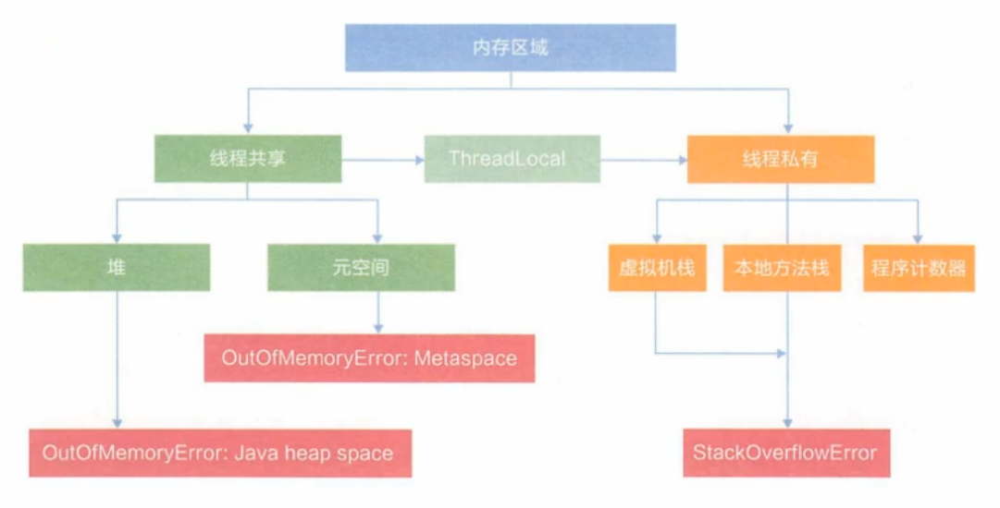
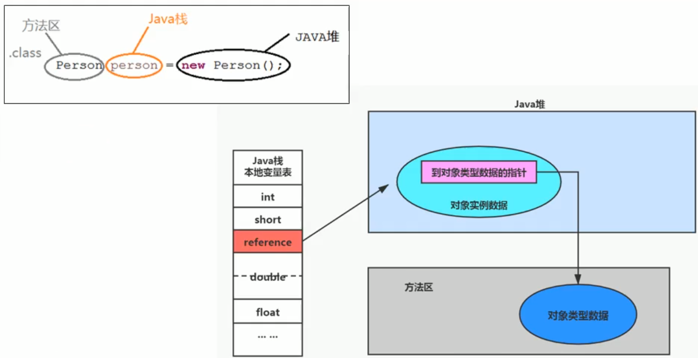
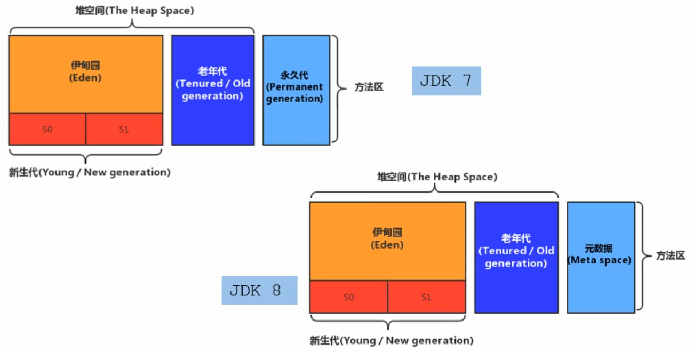
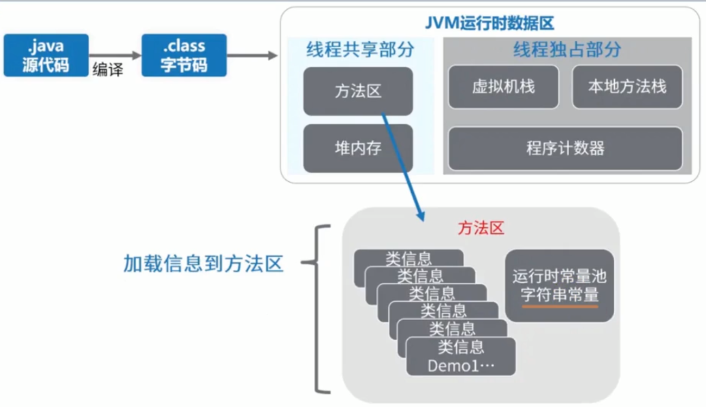
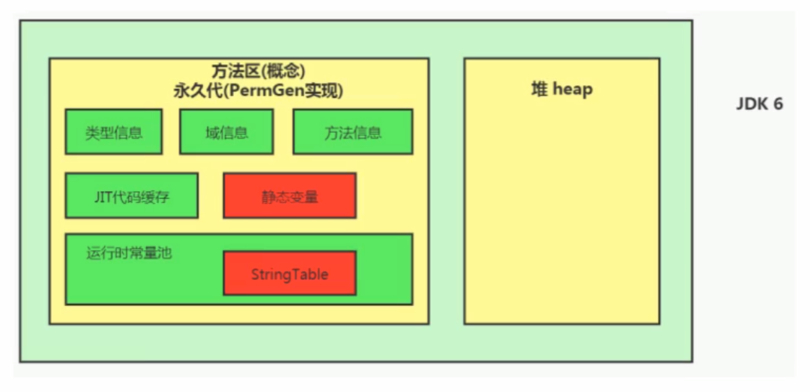
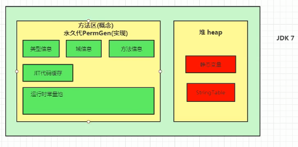
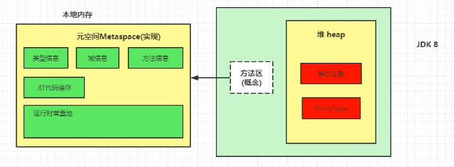
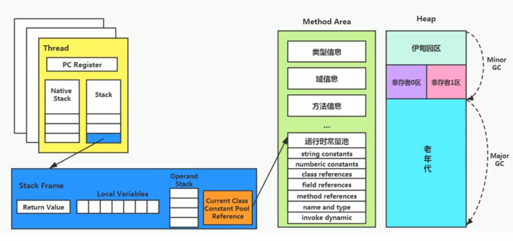

# 方法区

## 栈, 堆, 方法区的交互关系





## 方法区的理解

The Java® Virtual Machine Specification Java SE 8 Edition:
> Although the method area is logically part of the heap, simple implementations may choose not to either garbage collect or compact it.  

Java虚拟机规范中说明: "尽管所有的方法区在逻辑上是属于堆的一部分, 但是一些简单的实现可能不会选择去进行垃圾收集或者进行压缩". 但对于HotSpot JVM而言, 方法区还有一个别名叫做Non-Heap(非堆), 目的就是要和堆分开.

所以, 方法区看作是一块独立于Java堆的内存空间

方法区(Method Area)与Java堆一样, 是各个线程共享的内存区域.

方法区在JVM启动的时候被创建, 并且它的实际的物理内存空间中和Java堆一样都是不可连续的

方法区的大小, 跟堆空间一样, 可以选择规定大小或者可拓展

方法区的大小决定了系统可以保存多少个类, 如果系统定义了太多的类, 导致方法区溢出, 虚拟机同样会抛出内存溢出错误: java.lang.OutOfMemoryError: PermGen space或者 java.lang.OutOfMemoryError: Metaspace. 如加载大量的第三方的jar包; Tomcat部署的工程过多(30-50个); 大量动态的生成反射类

关闭JVM就会释放这个区域的内存

## HotSpot中方法区的演进

在JDK 7 以前, 习惯把方法区称为永久代. JDK 8开始, 使用用空间取代永久代(本地内存)

本质上, 方法区和永久代并不等价.《Java虚拟机规范》对如何实现方法区, 不做统一要求. 例如，BEA JRockit/IBM J9 中不存在永久代的概念. 方法区等价于永久代仅是针对于JDK 7 之前的HotSpot虚拟机. 

使用永久代导致程序更容易出现OOM(超过了`-XX:MaxPermSize`上限)



而到了JDK 8, 终于完全废弃了永久代的概念, 改用与JRockit, J9一样在本地内存中实现的元空间来代替.

元空间的本质和永久代类似, 都是对JVM规范中方法区的实现. 不过元空间与永久代最大的区别在于: **元空间不在虚拟机设置的内存中, 而是使用本地内存**

永久代, 元空间二者并不只是名字变了. 内部结构也调整了.

根据《Java虚拟机规范》的规定, 如果方法区无法满足新的内存分配需求时, 将抛出OOM异常

## 设置方法区大小与OOM

方法区的大小不必是固定的, JVM可以根据应用的需要动态调整

- JDK 7及以前:
    - 通过 `-XX:PermSize`来设置永久代初始分配空间, 默认值是20.75M
    - `-XX:MaxPermSize`来设置永久代最大可分配空间. 32位机器默认是64M, 64位机器默认是82M
    - 当JVM加载的类信息容量超过了这个值就会报异常OutOfMemoryError: PermGen space
- JDK 8及以后:
    - 元数据区大小可以使用参数`-XX:MetaspaceSize`和`-XX:MaxMetaspaceSize` 指定, 替代上述原有的两个参数.
    - 默认值依赖于平台. Windows下, `-XX:MetaspaceSize`是21M, `-XX:MaxMetaspaceSize`的值是-1, 即没有限制.
    - 与永久代不同, 如果不指定大小, 默认情况下, 虚拟机会耗尽所有可用的系统内存. 如果元数据区发生溢出, 虚拟机一样会抛出异常OutOfMemoryError: Metaspace
    - `-XX:MetaspaceSize`: 设置初始的元空间大小. 对于一个64位的服务端JVM来说, 其默认的`-XX:MetaspaceSize`值为21MB. 这就是初始的高水位线, 一旦触及这个水位线, Full GC将会被触发并卸载没用的类, 然后这个高水位线将会重置. 新的高水位线的值取决于GC后释放了多少元空间, 如果释放的空间不足, 那么在不超过MaxMetaspaceSize时, 适当提高该值. 如果释放空间过多, 则适当降低该值.
    - 如果初始化的高水位线过低, 上述高水位线调整情况会发生很多次, 通过垃圾回收器的日志可以观察到Full GC多次调用. 为了避免频繁地GC, 建议将`-XX:MetaspaceSize`设置为一个相对较高的值

JDK 6: 类型信息, 静态变量和字符串常量, JIT代码缓存, 字段信息, 方法信息等都放在永久代中
JDK 7: 静态变量和字符串常量池放在堆中, 剩余内容放在永久代中, 
JDK 8: 静态变量和字符串常量池在堆中, 剩余内容转移到了元空间(本地内存)中, 

如何解决OOM

1. 要解决OOM异常或heap space的异常, 一般的手段是首先通过内存映像分析工具(如Eclipse Memory Analyzer)对dump出来的堆转储快照进行分析, 重点是确认内存中的对象是否必要, 也就是要先分清楚到底是出现了内存泄漏(Memory Leak)还是内存溢出(Memory Overflow)
2. 如果是内存泄漏, 可进一步通过工具查看泄露对象到GC Roots的引用链, 于是就能找到泄露对象是透过怎样的路径与GC Roots相关联导致垃圾收集器无法自动回收他们的. 掌握了泄露对象的类型信息, 以及GC Roots引用链的信息, 就可以比较准确地定位出泄露代码的位置
3. 如果不存在内存泄漏, 换句话说就是内存中的对象确实都还必须存活者, 那就应当检查虚拟机的堆参数(`-Xmx`与`-Xms`), 与机器物理内存对比看是否还可以调大; 从代码上检查是否存在某些对象生命周期过长, 持有状态时间过长的情况, 尝试减少程序运行期的内存消耗.

## 方法区的内部结构



《深入理解Java虚拟机》书中堆方法区(Method Area)存储内容描述如下: 它用于存储已被虚拟机加载的**类型信息**, **常量**, **静态变量**（JDK 7及之后的版本被转移至堆中）, **即时编译器编译后的代码缓存**等.

### 类型信息

对每个加载的类型(类class, 接口interface, 枚举enum, 注解annotation), JVM必须在方法区中存储一下类型信息:

1. 这个类型的完整有效名称(全名=包名.类名)
2. 这个类型直接父类的完整有效名(对于interface或是java.lang,Object, 都没有父类)
3. 这个类型的修饰符(public, abstract, final的某个子集)
4. 这个类型直接接口的有序列表

### 域(Field)信息

JVM必须在方法区中保存类型的所有与相关的信息以及域的生命顺序

域的相关信息包括: 域名称, 域类型, 域修饰符(public, private, protected, static, final, volatile, transient的某个子集)

### 方法(Method)信息

JVM必须保存所有方法的以下信息, 同域信息一样包括声明顺序:

1. 方法名称
2. 方法的返回类型(或 void)
3. 方法参数的数量和类型(按顺序)
4. 方法的修饰符(public, private, protected, static, final, synchronized, native, abstract的一个子集)
5. 方法的字节码(bytecodes), 操作数栈, 局部变量表及大小(abstract和native方法除外)
6. 异常表(abstract堆和native方法除外)
    - 每个异常处理的开始位置, 结束位置, 代码处理在程序计数器中的偏移地址, 被捕获的异常类的常量池索引

### non-final的静态变量

静态变量和类关联在一起, 随着类的加载而加载, 他们成为类数据在逻辑上的一部分

静态变量被类的所有实例共享, 即使没有类实例时也可以访问它

注：被声明为final的静态变量的处理方法则不同, 每个全局常量在**编译**的时候就会被分配了

### 运行时常量池

- 方法区, 内部包含了运行时常量池
- 字节码文件, 内部包含了常量池
- 要弄清楚方法区, 需要理解清楚ClassFile, 因为加载类的信息都放在方法区
- 要弄清楚方法区的运行时常量池, 需要理解清楚ClassFile中的常量池

一个有效的字节码文件中除了包含类的版本信息, 字段, 方法以及接口等描述信息外, 还包含一项信息那就是常量池(Constant Pool Table), 包括各种字面量和对类型, 域和方法的符号引用.

**为什么需要常量池?**

一个Java源文件中的类, 接口, 编译后产生一个字节码文件. 而Java中的字节码需要数据支持, 通常这种数据会很大以至于不能直接存到字节码中, 换另一种方式, 可以存到常量池, 这个字节码包含了指向常量池的引用. 在动态连接的时候会用到运行时常量池

常量池, 可以看做是一张表, 虚拟机指令根据这张常量表找到要执行的类名, 方法名, 参数类型, 字面量等类型

**运行时常量池**

- 运行时常量池(Runtime Constant Pool)是方法区的一部分
- 常量池(Constant Pool Table)是Class文件的一部分, 用于**存放编译期间生成的各种字面量与符号引用**, **这部分内容将在类加载后存放到方法区的运行时常量池中**.
- 在加载类和接口到虚拟机后, 就会创建对应的运行时常量池
- JVM为每个已加载的类型(类或接口)都维护了一个常量池. 池中的数据项像数组项一样通过**索引访问**的.
- 运行时常量池中包含多种不同的常量, 包括编译器就已经明确的数值字面量, 也包括到运行期解析后才能获得的方法或者字段引用. 此时不再是常量池中的符号地址, 这里转换为**真实地址**.
- 运行时常量池, 相对于Class文件常量池的另一重要特征是: **具备动态性**. 
- 运行时常量池类似于传统编程语言中的符号表(symbol table), 但是它所包含的数据却比符号表要更加丰富一些.
- 当创建类或接口的运行时常量池时, 如果构造运行时常量池所需的内存空间超过了方法区所能提供的最大值, 则JVM会抛OutOfMemoryError异常

## 方法区的演进细节

1. 首先明确: 只有HotSpot才有永久代
BEA JRockit, IBM J9等来说, 是不存在永久代的概念的. 原则上如何实现方法区属于虚拟机实现细节, 不受《Java虚拟机规范》管束, 并不同求统一
2. HotSpot中方法区的变化

|版本|方法区实现|
|---|-----|
|JDK 6及之前|类型信息(字段, 方法, 常量信息等), JIT编译代码缓存, 静态变量和字符串常量都放在永久代中(permanent generation)|
|JDK 7|有永久代, 但已经逐步"去永久代", 类型信息, JIT编译代码缓存放在永久代中, 静态变量和字符串常量池放在堆中|
|JDK 8及之后|无永久代, 类型信息, 字段信息, 方法信息, 常量信息, JIT编译代码缓存保存在本地内存的元空间, 但字符串常量池, 静态变量仍在堆中|







**为什么永久代要被元空间替换呢?**

1. 为永久代设置空间大小是很难确定的
在某些场景下, 如果动态加载类过多, 容易产生Perm区的OOM. 比如某个实际Web工程中, 因为某些功能点比较多, 在运行过程中, 要不断动态加载很多类, 经常出现致命错误. 而元空间和永久代之间最大的区别在于: 元空间并不在虚拟机中, 而是使用本地内存. 因此, 默认情况下, 元空间的大小仅受本地内存限制.
2. 对永久代进行调优是很困难的

**字符串常量池(StringTable)为什么要调整**

JDK7中将StringTable放到了堆空间中. 因为永久代的回收效率很低, 在Full GC的时候才会触发. 而Full GC是老年代, 永久代不足时才会触发. 这就导致StringTable回收效率不高. 而我们开发中会有大量的字符串被创建, 回收效率低, 导致永久代内存不足. 放到堆里, 能及时回收内存还能降低Full GC发生频率.

**静态变量存放位置**

```java
public class StaticField {
    static Object staticObject = new Object();
    Object instanceObject = new Object();

    public static void main(String[] args) {
        new StaticField();
        Object localObject =  new Object();
    }
}
```

静态变量, 成员变量, 局部变量指向的对象实体`new Object()`都是存放在堆中的. `new`关键词创建的对象都是在堆中的.

静态变量`staticObject`在JDK 6及之前是存放在永久代中的; 在JDK7及之后HotSpot虚拟机选择把静态变量与类型在Java语言一端的映射Class对象存放在一起, 存储与Java堆之中.

成员变量`instanceObject`随着`StaticField`对象的实例存放在Java堆中.

局部变量`localObject`则是存放在`main`方法栈帧的局部变量表中.


## 方法区的垃圾回收

《Java虚拟机规范》对于方法区的约束时非常宽松的, 提到过可以不要求虚拟机在方法区中实现垃圾回收. 事实上也确实有为实现或未能完整实现方法区类型卸载的收集器存在.

一般来说这个区域的收集回收效果比较难令人满意, 尤其是类型的卸载. 但是这部分区域的回收有又确实是必要的. 以前Sun公司的BUG列表中, 曾出现过的若干个严重的BUG就是由于低版本的HotSpot虚拟机对此区域未完全回收而导致内存泄漏.

方法区的垃圾收集主要回收两部分内容: **常量池中废弃的常量**和**不再使用的类型**

### 常量池中废弃的常量

方法区内常量池之中主要存放两大类常量: 字面量和符号引用.
字面量比较接近Java语言层次的常量概念, 如文本字符串, 被声明为final的常量值等. 而符号引用则属于编译原理方面的概念, 包括下面三类常量:

- 类和接口的全限定名
- 字段的名称和描述符
- 方法的名称和描述符

HotSpot虚拟机对常量池的回收策略是很明确的, 只要常量池中的常量没被任何地方引用, 就可以被回收.

回收常量与回收Java堆中的对象非常类似

### 不再使用的类型

判定一个常量是否废弃"废弃"还是相对简单的, 而要判定一个类型是否属于"不再被使用的类"的条件就比较苛刻了. 要同时满足下面三个条件:

1. 该类所有的实例都已经被回收, 也就是Java堆中不存在该类及其任何派生子类的实例
2. 加载该类的类加载器已经被回收, 这个条件除非是经过精心设计的可替换类加载器的场景, 如OSGI, JSP的重加载等, 否则是很难达成的
3. 该类对应的java.lang.Class对象没有在任何地方被引用, 无法在任何地方通过反射访问该类的方法

Java虚拟机被允许对满足上述三个条件的无用类进行回收, 这里说的仅仅是"被允许", 而并不是和对象一样, 没有引用就必然会回收. 关于是否要对类型进行回收, HotSpot虚拟机提供了`-Xnoclassgc`参数进行控制, 还可以使用`-verbose:calss`以及`-XX:+TraceClass-Loading`, `-XX:+TraceClassUnloading`查看类加载和卸载信息.

在大量使用反射, 动态代理, CGLib等字节码框架, 动态生成JSP以及OSGi这类频繁自定义类加载器的场景中, 通常都需要Java虚拟机具备类型卸载的能力, 以保证不会对方法区造成过大的内存压力.

### 总结

