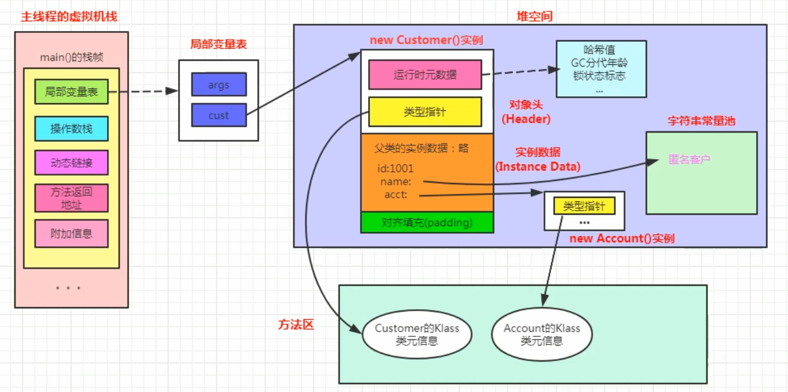
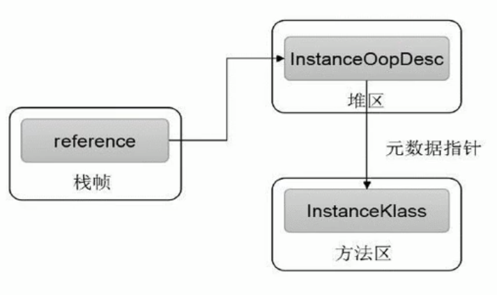
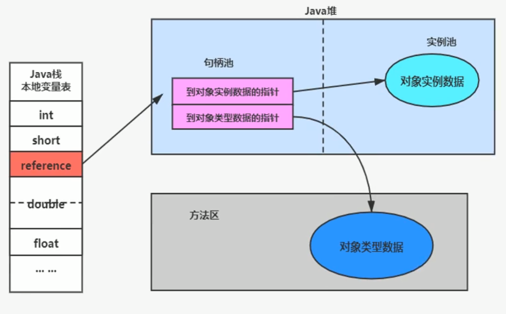
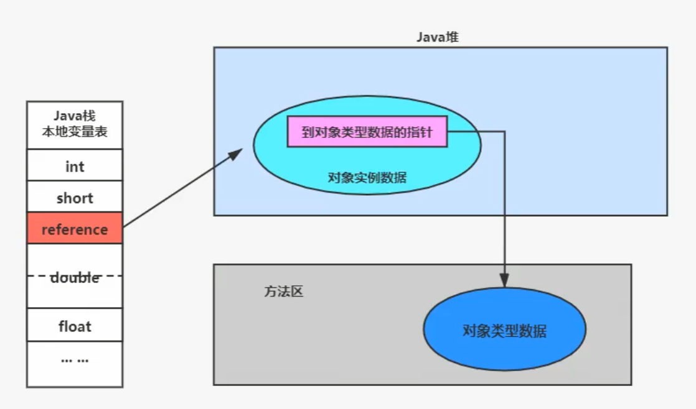

# 对象的实例化, 内存布局与访问定位

## 对象的实例化

### 创建对象的方式

1. `new`: 通过构造器创建, 是最常见的方式
    - 变形1: XXX的静态方法
    - 变形2: XXXBuilder/XXXFactory的静态方法
2. `Class`的`newInstance`: 反射的方式
    - 只能调用空参构造器, 权限必须是`public`
    - 此方法从JDK 9开始被弃用
3. `Constructor`的`newInstance`: 反射的方式
    - 可以调用空参, 带参的构造器, 权限没有限制
4. `clone`方法: 不调用任何构造器, 但需要当前类需要实现`Cloneable`接口, 实现`clone`方法
5. 使用反序列化: 从文件, 网络等获取一个对象的二进制流
6. 第三方库Onjenesis

## 对象创建的步骤

1. 判断对象对应的类是否加载, 链接, 初始化

虚拟机遇到一条`new`指令, 首先去检查这个指令的参数能否在Metaspace的常量池中定位到一个类的符号引用, 并且检查这个符号引用代表的类是否已经被加载, 解析和初始化(即判断类元信息是否存在), 如果没有, 那么在双亲委派模式下, 使用 当前类加载器ClassLoader+包名+类名 为Key进行查找对应的`.class`文件.  如果没有找到文件, 则抛出`ClassNotFoundException`异常, 如果找到, 则进行类加载, 并生成对应的Class类对象.

2. 为对象分配内存 

首先计算对象占用空间大小, 接着在堆中划分一块内存给新对象, 如果实例成员变量是引用变量, 仅分配引用变量空间即可, 即4个字节大小.

- 如果内存规整
    - **指针碰撞**, 意思是所有用过的内存在一边, 空闲的内存在另外一边, 中间放着一个指针作为分界点的指示器, 分配内存就仅仅把指针向空闲那边挪动一段与对象大小相等的距离罢了. 如果垃圾收集器选择的是Serial, ParNew 这种基于压缩算法的, 虚拟机采用这种分配方式. 一般使用带有compact(整理)过程的收集器时, 使用指针碰撞.
- 如果内存不规整
    - 已使用的内存和未使用的内存相互交错, 那么虚拟机将采用的是**空闲列表法**来为对象分配内存. 意识是虚拟机维护了一个列表, 记录哪些内存块是可用的, 再分配的时候从列表中找到一块足够大的空间划分给对象实例, 并更新列表上的内容. 这种分配方式称为"空闲列表(Free List)". CMS收集器就是采用这种方式.

3. 处理并发安全问题

- 采用CAS失败重试, 区域枷锁保证更新的原子性
- 每个线程预先分配一块TLAB - 通过 `-XX:+UseTLAB`参数来设定

4. 属性的默认初始化

所有属性**设置默认值**, 保证对象实例字段在不赋值时可以直接使用.

5. 设置对象的对象头

将**对象的所属类(即类的元数据信息, 指向方法区)**, **对象的HashCode**和**对象的GC属性**, **锁信息**等数据存储在对象的对象头中, 这个过程的具体设置方式取决于JVM实现.

6. 执行init方法进行初始化

在Java程序的视角看来, 初始化才正式开始, **成员变量显式初始化**, **执行初始化代码块**, **调用类的构造方**, 并把堆内对象的首地址赋值给引用对象

## 对象的内存布局

- 对象头(Header)
    - 运行时元数据(Mark Word)
        - 哈希码(HashCode)
        - GC分代年龄
        - 锁状态标志
        - 线程持有的锁
        - 偏向线程ID
        - 偏向时间戳
    - 类型指针: 指向类元数据InstanceKlass, 确定该对象所属的类型
    - 注: 如果是数组, 还需要记录数组的长度
- 实例数据(Instance Data)
    - 实例数据是对象真正存储的有效信息, 包括程序代码中定义的各种类型的字段(包括从父类继承下来的和本身拥有的字段)
    - 规则: 相同宽度的字段总是被分配在一起, 父类中定义的变量会出现在子类之前, 如果CompactFields参数为true(默认为ture), 子类的窄变量可能插入到父类的空袭
-  对齐填充(Padding): 不是必须的, 也没有特殊含义, 仅仅起到占位符的作用

```java
public class Customer {
    // 显式初始化
    int id = 100;
    String name;
    Account acct;

    // 初始化代码块
    {
        name = "匿名客户";
    }

    public Customer() {
        acct = new Account()
    }
}

class Customer {}
```

图例:



## 对象的访问定位



创建对象的目的是为了使用它. JVM栈帧中局部变量存储的地址值找到对应的对象.

对象的访问方式主要有两种:

**句柄访问**



优点: 对象位置移动时, 只会修改句柄池中的指针, 而不会改变本地变量表中的引用

**直接指针(HotSpot采用)**



优点: 效率高, 节省空间