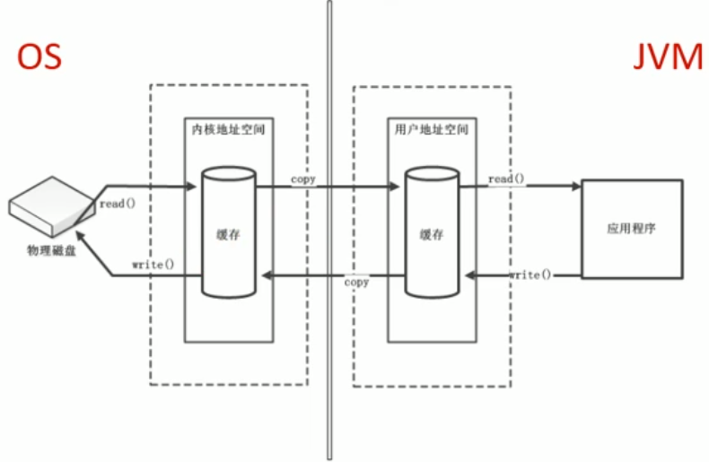
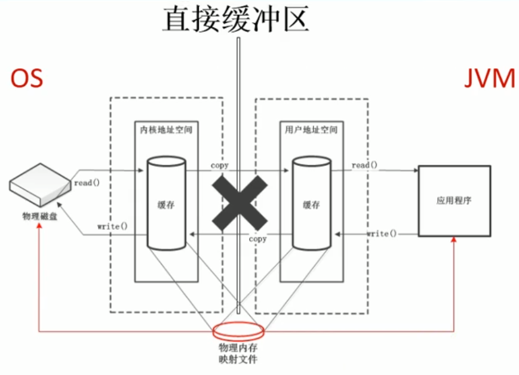

# 直接内存(Direct Momery)

## 概述

直接内存不是虚拟机运行时数据区的一部分, 也不是《Java虚拟机规范》中定义的内存区域.

直接内存是在Java堆外, 直接向系统申请的内存空间

来源于NIO(New IO/Non-Blocking IO), 通过存在于堆中的`ByteBuffer`操作Native内存

可通过`java.nio.ByteBuffer`的`allocateDirect`方法分配Native内存.

通常, 访问直接内存的速度会优于Java堆, 即读写性能高. 因此处于性能考虑, 读写频繁的场合可能会考虑使用直接内存. Java的NIO库允许Java程序使用直接内存, 用于数据缓冲区.

## 直接内存的效率

**非直接缓冲区**

读写文件, 需要与磁盘交互, 需要由用户态切换到内核态. 在使用读写时, 需要经过两个内存之间的复制操作, 因此效率低.

**直接缓冲区**

使用NIO时, 操作系统划出的直接缓存区可以被Java代码直接访问, 不存在两个内存之间的复制过程, 只有疑问. NIO适合对大文件的读写操作.

## 直接内存的OOM

直接内存也可能会导致`OutOfMemoryError: Direct buffer memory`异常

由于直接内存在Java堆外, 因此它的大小不会直接受限于`-Xmx`指定的最大堆大小, 但是系统内存是有限的, Java堆和直接内存的综合依然受限于操作系统能给出的最大内存.

缺点:

- 直接内存分配回收成本较高
- 不受JVM内存回收管理

直接内存大小可以通过MaxDirectMemorySize设置

如果不设定, 默认与堆的最大值-Xmx参数值一致