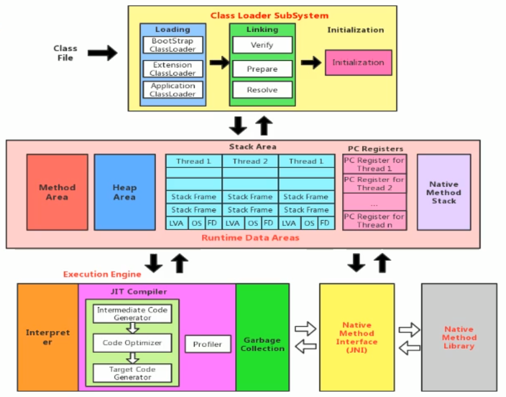
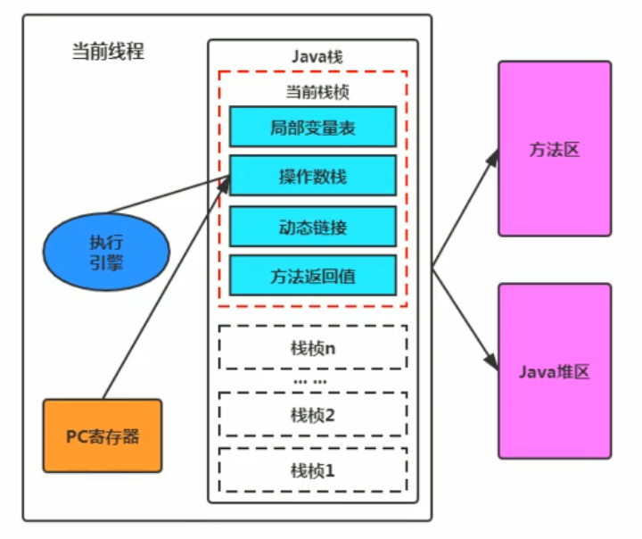
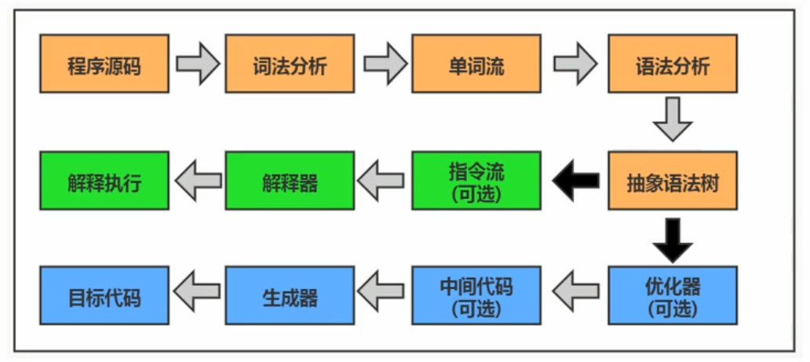
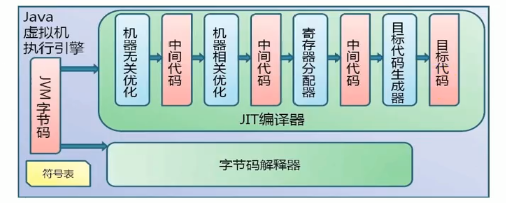
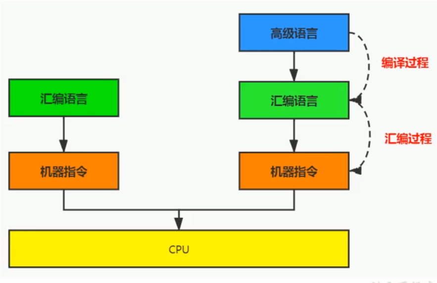
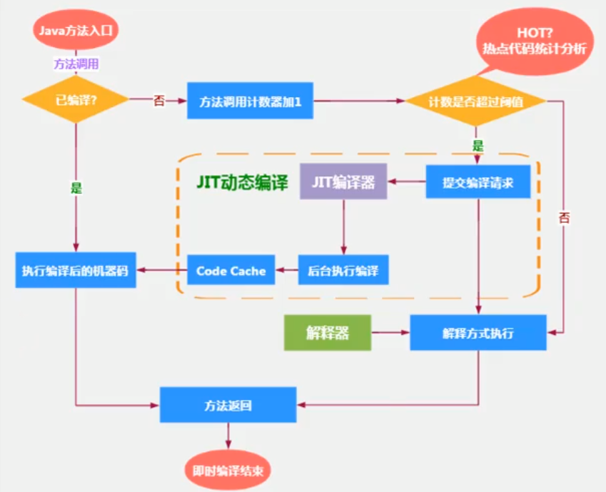
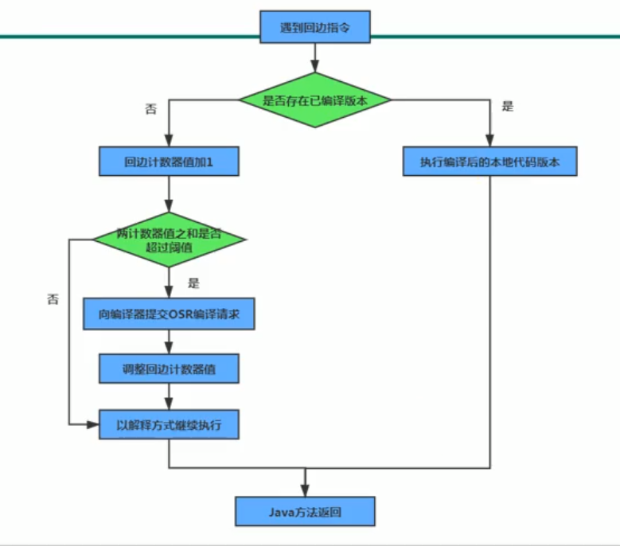

# 执行引擎

## 执行引擎概述

执行引擎是Java虚拟机核心的组成部分之一

"虚拟机"是一个相对与"物理机"的概念, 这两种机器都有代码执行能力, 其区别是物理机的执行引擎是直接建立在处理器, 缓存, 指令集和操作系统层面上的, 而**虚拟机的执行引擎则是由软件自行实现**的, 因此可以不受物理条件制约地定制指令集与执行引擎的体系结构, **能够执行那些不被硬件直接支持的指令集格式**.

JVM的主要任务是**负责装载字节码到其内部**, 但字节码并不能够直接运行在操作系统之上, 因为字节码指令并非等价于非本地机器指令, 它内部包含的仅仅只是一些能够被JVM所识别的字节码指令, 符号表, 以及其他辅助信.

那么如果想让一个Java程序运行起来, 执行引擎(Execution Engine)的任务就是将**字节码指令解释/编译为对应平台上的本地机器指令**才可以. 简单来说, JVM中的执行引擎充当了将高级语言翻译为机器语言的译者.

## 执行引擎的工作过程

1. 执行引擎在执行过程中究竟需要执行什么样的字节码指令完全依赖于PC寄存器
2. 每当执行完一条指令操作后, PC寄存器就会更新下一条需要被执行的指令地址
3. 当然方法在执行的过程中, 执行引擎可能会通过存储在局部变量表中的对象引用准确定位到存储在Java堆区中的对象实力信息, 以及通过对象头中的元数据指针定位到目标对象的类型信息

## Java代码编译和执行的过程

- 橙色标识的流程是`javac`前端编译流程
- 绿色标识的流程是解释器的执行流程(半解释)
- 蓝色标识的流程是JIT编译器的编译流程(半编译)

因此Java是一门**半编译半解释型语言**

**解释器(Interpreter)**: 当Java虚拟机启动时会根据定义的规范**对字节码采用逐行解释的方式执行**, 将每条字节码文件中的内容"翻译"为对应平台的本地机器指令执行.

**JIT编译器(Just In Time Compiler)**: 就是虚拟机将源代码直接编译成会本地机器平台相关的机器语言.

## 机器码, 指令, 汇编语言

### 机器码

使用二进制编码方式表示的指令, 叫做**机器指令码**, 机器语言能够被计算机理解和执行, 执行效率最高.

- 机器码和人们的语言差别太大, 不容易被人们理解和记忆
- 机器指令与CPU紧密相关, 所有不同种类的CPU所对应的机器码指令也就不同

### 指令

由于机器码是由0和1组成的二进制序列, 可读性太差, 于是人们发明了指令

指令就是把机器码中特定的0和1序列, 简化成对应的指令(一般为英文简写, 如mov, inc等), 可读性好.

由于不同的硬件平台, 执行同一个操作, 对应的机器码可能不同, 所以不同的硬件平台的同一指令对应的机器码也可能不同.

### 指令集

不同的硬件平台, 各自支持的指令是有差别的, 因此每个平台所支持的指令称之为对应平台的指令集.

- x86指令集: 对应x86架构的平台
- ARM指令集: 对应ARM架构的平台

### 汇编语言

由于指令的可读性还是太差, 于是人们又发明了汇编语言.

汇编语言中, 使用**助记符(Mnemonics)**代替机器指令的操作码, 用**地址符号(Symbol)**或**标号(Label)**代替指令或者操作数的地址.

在不同的硬件平台, 汇编语言对应着不同的机器语言指令集, 通过汇编过程转换成机器指令

由于计算机只认识指令码, 所以用汇编语言编写的程序还必须翻译成机器指令码, 计算机才能识别和执行.

### 高级语言

为了使计算机用户编程更容易, 后来就出现了各种高级计算机语言. 高级语言比机器语言更接近人的语言

但计算机执行高级语言编写的程序时, 仍需要把程序解释或编译成机器的指令码. 完成这个过程就叫作解释程序或编译程序.

## 解释器

解释器真正意义上所承担的角色就是一个运行时"翻译者". 将字节码文件中的内容"翻译"为对应平台的本地机器指令执行.

当一条字节码指令被执行完成后, 接着再对PC寄存器中记录的下一条需要被执行的字节码指令执行解释操作.

基于解释器执行已经沦落为低效的代名词, 为了解决这个问题, JVM平台支持了一种叫做即时编译的技术. 即时编译的目的是避免函数被解释执行, 而是将整个函数体编译成为机器码, 每次函数执行时, 只执行编译后的机器码即可, 这种方式可以是执行效率大幅度提升.

## JIT编译器

HotSpot VM是目前市面上高性能虚拟机的代表作之一. 它采用**解释器与即时编译器并存的架构**. 在Java虚拟机运行时, 解释器和即时编译器能够互相协作, 各自取长补短, 尽力去选择最合适的方式来权衡编译本地代码的时间和直接解释执行代码的时间.

当虚拟机启动的时候, **解释器可以首先发挥作用**, 而不必等待即时编译器全部编译完成后执行, 这样可以**省去许多不必要的编译时间**. 并且随着程序运行时间的推移, 即时编译器逐渐发挥作用, 根据*热点探测功能*, **将有价值的字节码编译为本地机器指令**, 以换取更高的程序执行效率.

Java 语言的"编译器"其实是一段"不确定"的操作过程, 因为它可能是指一个**前端编译器**, 负责把`.java`编译成`.class`文件; 也可能是指虚拟机的**后端运行期编译器(JIT 编译器, Just In Time Compiler)**, 把字节码转变成机器码的过程. 还可能是指使用**静态提前编译器(AOT 编译器, Ahead Of Time Compiler)**直接把`.java`文件编译成本地机器代码的过程.

## 热点代码及探测方式

当然是否需要启动JIT编译器将字节码直接编译为对应平台的本地机器指令, 则需要根据代码被**调用执行的频率**而定. 关于那些需要被编译为本地代码的字节码, 也被称之为**热点代码**, JIT编译器在运行时会针对那些频繁被调用的热点代码做出**深度优化**, 将其直接编译为对应平台的本地机器指令, 以此提升Java程序的执行性能.

**一个被多次调用的方法, 或者是一个方法内部循环次数较多的循环体都可以被称之为热点代码**, 因此都可以通过JI编译器编译为本地机器指令. 由于这种编译方式发生在方法的执行过程中, 因此也称之为**栈上替换, 或简称为OSR(On Stack Replacement)编译**.(注: 对象也都不一定都是在栈上分配的, 如果变量没有发生逃逸, 就可能出现变量的**栈上分配**).

一个方法究竟要被调用多少次, 或者一个循环体究竟要执行多少次循环才可以达到这个标准? 这里只要依靠热点探测功能. 目前HotSpot VM所采用的热点探测方式是**基于计数器的热点探测**.

采用基于计数器的热点探测, HotSpot VM 将会为每一个方法都建立2个不同类型的计数器, 分别为**方法调用计数器(Invocation Counter)**和**回边计数器(Back Edge Counter)**

- 方法调用计数器用于统计方法的调用次数.
- 汇编计数器用于统计循环体执行的循环次数.

## 方法调用计数器

方法调用计数器就用于统计方法被调用的次数, 它的默认阈值在Client模式下是1500次, 在Server模式下是10000次. 超过这个阈值, 就会触发JIT编译.

这个阈值可以通过虚拟机参数`-XX:CompileThreshold`来认为设定

当一个方法被调用时, 会先检查该方法是否存在被JIT编译过的版本, 如果存在, 则优先使用编译后的本地代码来执行. 如果不存在已经编译过的版本, 则将此方法的调用计数器加1, 然后判断方法调用计数器与回边计数器之和是否超过方法调用计数器的阈值. 如果已超过阈值, 那么将会向即时编译器提交一个该方法的代码编译请求.

## 热度衰减

如果不做任何设置, 方法调用计数器统计的并不是方法被调用的绝对次数, 而是一个相对的执行频率, 即**一段时间之内方法被调用的次数**. 当超过**一定时间限度**, 如果方法的调用次数仍然不足以让他提交给即时编译器编译, 那这个方法的调用计数器就会**减少一半**, 这个过程成为方法调用计数器热度的**衰减(Counter Decay)**, 而这段时间就称为此方法统计的**半衰周期(Counter Half Life Time)**.

使用`-XX:-UseCounterDecay`参数来关闭热度衰减, 让方法计数器统计方法调用的绝对次数. 这样, 只要系统运行时间足够长, 绝大部分方法都会被编译成本地代码.

使用`-XX:CounterHalfLifeTime`参数设置半衰周期时间, 单位是秒.

## 回边计数器

回边计数器的作用是统计一个方法中**循环体代码执行的次数**. 在字节码中遇到控制流向后跳转的指令称为**回边(Back Edge)**. 显然建立回边计数器统计的目的就是为了触发OSR编译.

## HotSpot VM执行方式设置

缺省情况下HotSpot VM是采用解释器与即时编译器并存的架构, 当然开发人员可以根据具体的应用场景, 通过显示命令显式地为Java虚拟机指定时完全采用解释器执行, 还是完全采用即时编译器执行.

- `Xinit`: 完全采用解释器模式执行程序
- `-Xcomp`: 完全采用编译器模式执行程序. 如果即时编译出现问题, 解释器会介入执行
- `Xmixed`: 采用解释器+即时编译器的混合模式共同执行程序

## JIT编译器的分类

在HotSpot VM中内嵌有两个JIT编译器, 分别为Client Compiler和Server Compiler, 但大多数情况下我们简称为C1编译器和C2编译器, 开发人员可以通过如下命令显式指定Java虚拟机在运行时到底是用哪一种即时编译器.

- `-client`: 指定Java虚拟机运行在client模式下, 并使用C1编译器
    - C1编译器会对字节码进行简单和可靠的优化, 耗时短. 以达到更快的编译速度.
- `-server`: 指定Java虚拟机运行在Server模式下, 并使用C2编译器
    - C2编译器进行耗时较长的优化, 以及激进优化. 但优化的代码执行效率更高.

## C1编译器和C2编译器的优化策略

C1编译器上主要有方法内敛, 去虚拟化, 冗余消除

- 方法内联: 将引用的方法代码编译到引用点处, 这样可以减少栈帧的生成, 减少参数传递以及跳转过程
- 去虚拟化: 对唯一的实现类进行内联
- 冗余消除: 在运行期间把一些不会执行的代码折叠掉

C2编译器的优化主要是在全局层面, 逃逸分析时优化的基础. 基于逃逸分析在C2上有如下几种优化:

- 标量替换: 用标量代替聚合对象的属性
- 栈上分配: 对于为逃逸的对象分配对象在栈而不是堆
- 同步消除: 消除同步操作, 通常指`synchronized`

**标量替换**, **栈上分配**, **同步消除**的详细内容可以参见堆一节

## Graal编译器

Graal编译器是一个全新的编译器, 编译效果短短几年就追平了C2编译器, 未来可期.

目前, 带着"实验状态"的标签, 需要使用开关参数`-XX:+UnlockExperimentalVMOptions -XX:+UseJVMCICompiler`去激活才可以使用.

## AOT编译器

JDK9引入了AOT编译器(静态提前编译器, Ahead OF Time Compiler), Java 9引入了实验性AOT编译工具`jatic`, 他借助了Graal编译器, 将所输入的Java类文件转换为机器码, 并存放至生成的动态共享库之中.

JIT编译器实在程序执行过程中, 将字节码转换为可在硬件上直接运行的机器码, 并部署托管环境的过程.

AOT编译器则是在程序运行之前, 将字节码转换为机器码的过程.

AOT的优点: Java虚拟机只需加载预先编译好的二进制库, 可以执行, 不必等待即时编译器的预热

AOT的缺点:
    - 破坏了Java的"一次编译, 到处运行", 必须为不同的硬件, OS编译对应的发行包.
    - 降低了Java链接过程的, 加载的代码在编译器就必须全部已知
    - 还需要继续优化中, 最初只支持Lnux x64 java base
